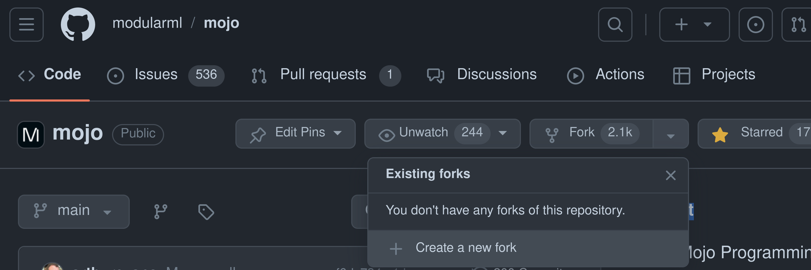
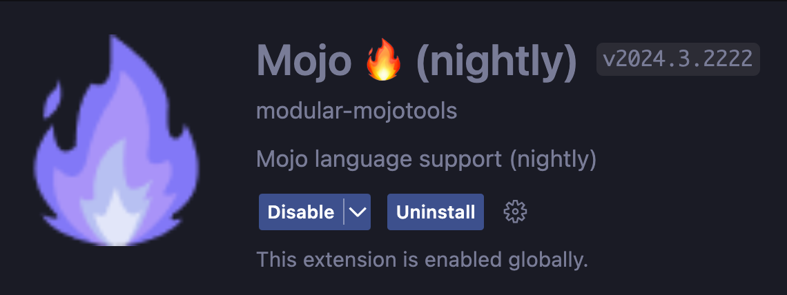
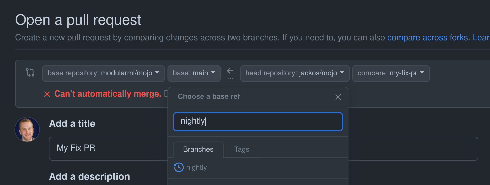

# Mojo contributor guide

Welcome to the Mojo community! 🔥 We’re very excited that you’re interested in
contributing to the project. To help you get started and ensure a smooth
process, we’ve put together this contributor guide.

There are many ways to contribute to the project, from joining the
[Discord community](https://www.discord.gg/modular), to filing bugs, to
contributing documentation, examples, or code.

## Submitting bugs

Reporting issues is a great way to contribute to the project. Mojo uses GitHub
Issues for tracking bugs.

Keep in mind that bugs with a reproducible test case and well-written supporting
documentation are considered a higher priority. Ensure that reproducible steps
are the smallest possible to maximize contributor time.

Also, before opening a new issue, take a moment to search through the already
submitted issues to avoid creating duplicate issues for the maintainers to
address.

### Writing high-quality bug descriptions

We encourage you to provide as much information about the issue as practical.
The more details you provide, the faster we can resolve the issue. The following
is a template of the information that should accompany every submitted issue.

#### Issue template

- **Summary.** A descriptive summary of the issue.
- **Description.** A detailed account of the bug, including what was expected
  and what occurred.
- **Environment details.**
  - Mojo Compiler Version
  - Operating System version
  - Hardware Specifications
- **Severity/frequency.** An assessment of the impact ranging from inconvenience
  to a blocker.

## Contributing to docs and examples

We’re happy to accept pull requests for the docs and examples.
If your change is any one of the following, please create a pull request and we
will happily accept it as quickly as possible:

- Example code improvement:
  - Bug fix
  - Performance improvement
  - Code readability improvement
  - Conformity to style improvement
- Documentation improvement:
  - Typo fix
  - Markup/rendering fix
  - Factual information fix
  - New factual information for an existing page

Before embarking on any major change, please **create an issue** or
**start a discussion**, so we can collaborate and agree on a solution.

For example, refactoring an entire code example or adding an entire new page to
the documentation is a lot of work and it might conflict with other work that’s
already in progress. We don’t want you to spend time on something that might
require difficult reviews and rework, or that might get rejected.

See [Pull Requests](#pull-requests) for information on creating your first pull
request.

## Contributing to the standard library

The standard library team is dedicated to creating a vibrant technical community
around the Mojo programming language. Our vision includes a diverse and
inclusive environment where developers are motivated to contribute to the growth
of the Mojo package ecosystem with a myriad of community-driven additions.

For more information on our priorities, see the following documents:

- Our [Vision document](./stdlib/docs/vision.md) describes the guiding
  principles behind our development efforts.
- Our [Roadmap](./stdlib/docs/roadmap.md) identifies concrete development goals
  as we work towards an even more robust and feature-rich standard library.

For technical details on developing for the standard library, see the following
documents:

- [Developing the standard library](./stdlib/docs/development.md) covers building,
  testing, and other information you’ll need to work in the standard library.
- [Coding Standards and Style Guide](./stdlib/docs/style-guide.md) provides
  guidelines for writing code for the standard library.

### Accepting open source PRs

To ensure a streamlined process, contributors are encouraged to focus on
enhancements, bug fixes, and optimizations aligned with the library's
overarching goals. These guidelines aim to facilitate a collaborative
environment where contributors and the standard library team can work together
effectively toward the continued improvement of Mojo.

#### Changes we *accept*

These changes are uncontroversial, easier to review, and more likely to be
accepted:

- Well-documented bug fixes submitted with code reproducing the issue in a test
  or benchmark.
- Performance improvements that don’t sacrifice code readability or
  maintainability and are accompanied by benchmarks.
- Improvements to stdlib documentation or that expand on it.
- Improvements to the test coverage.
- Porting of tests from `FileCheck` to using `assert_*` functions from the
  `testing` module.
- Changes that address security vulnerabilities.

#### Changes we *avoid*

Changes that don’t align with our vision and roadmap are unlikely to be
accepted. For example:

- Changes that do not align with the published roadmap or the core principles of
  the standard library.
- Code without tests—especially for core primitives.
- Changes that break existing API or implicit behavior semantics.
- Changes where the contributors’ favorite feature or system isn’t being used
  and they submit a change unilaterally switching the project to use it. For
  example, the contributor doesn’t like CMake as a build system and submits a PR
  changing the repository to use their favorite build system.
- Adding support for esoteric platforms.
- Adding dependencies to the code base.
- Broad formatting or refactoring changes.
- Changes that need broad community consensus.
- Changes if contributors are not responsive.
- Adding an entire new module without going through the RFC/proposal process.

### About pull request sizes

We ask that contributors make pull requests as small as possible. When
you are opening a pull request, check the number of lines modified in GitHub.
The smaller the better (but don't exclude the tests or docstrings). If your
pull request is over 100 lines, please try to split it into multiple pull
requests. If you make them independant, it's even better as no synchronization
will be needed for the merge.

This guideline is here for the following reasons:

- **Higher quality reviews**: It is much easier to spot a bug in a few lines
than in 1000 lines.
- **Faster overall review**: Reviewers, to approve a pull request, need to
understand every line and understand how it fits into your overall change.
They also need to go back and forth between files and functions to understand
the flow of the code. This is exponentially hard as there are more lines in the code.
- **Avoiding blocking changes that are valid**: In a huge pull request, it's
likely that some changes are valid and some need to be reworked/discussed. If all
the changes are in the same pull request, then the valid changes will be be blocked
until all discussions have been resolved.
- **Reducing the number of git conflicts**: Bigger pull request means slower reviews,
thus means that the pull request will be open longer and will have more git conflicts
to be resolved before being merged.
- **Parallel processing**: All programmers like to parallelize. Well, reviewers also
like to parallelize code reviews to merge your code faster. If you open two pull
requests that are independent, then two reviewers will be able to work on your
code.
- **Finding the time for a code review**: Doing a code review often requires
that the code is reviewed in one go, as it's hard to remember functions and code
logic from one review session to another. Thus a big pull request will require
the reviewer to allocate a big chunk of time to do the code review, which is not
always possible and might delay the review and merge of your pull request
for multiple days.

Smaller pull requests means less work for the maintainers and faster reviews
and merges for the contributors. It's a win-win!

### Proposals

If you’re interested in making a significant change—one that doesn’t fall into
the list of “Changes we accept,” your first step is a written proposal. The
proposals process ensures feedback from the widest possible set of community
members and serves as an audit log of past proposal changes with most
importantly the rationale behind it.

Proposals consist of a GitHub [Pull Request](#pull-requests) that adds a
document to the [`proposals/`](./proposals) directory. Contributors are
encouraged to react with a *thumbs-up* to proposal PRs if they are generally
interested and supportive of the high-level direction. These are assigned to
Mojo standard library leads to decide. The proposal PR can be merged once the
assigned lead approves, all blocking issues have been decided, and any related
decisions are incorporated. If the leads choose to defer or reject the proposal,
the reviewing lead should explain why and close the PR.

This process is heavily inspired by the process used by several other
open-source projects. We’ll add more documentation in the future as we gain
experience with the process.

## Pull requests

You can use a pull request to propose a change or bug fix to the Mojo Standard
Library, Mojo examples, or Mojo documentation. This page gives an overview of
the process. For a more detailed walkthrough, see
[How to contribute to the Mojo standard library: a step-by-step guide](https://www.modular.com/blog/how-to-contribute-to-mojo-standard-library-a-step-by-step-guide).

**Note:** Pull requests should be submitted against the `nightly` branch,
which represents the most recent nightly build.

### Pull request process

#### First-time checklist

Before you start your first pull request, please complete this checklist:

- Read this entire contributor guide.
- Read the [Code of Conduct](./CODE_OF_CONDUCT.md).

#### Evaluate and get buy-in on the change

We want to be sure that you spend your time efficiently and prepare changes that
aren’t controversial and get stuck in long rounds of reviews. See the sections
on [Contributing to Docs and Examples](#contributing-to-docs-and-examples) and
[Contributing to the standard library](#contributing-to-the-standard-library)
for more details.

#### Fork and clone the repo

Go to the [Mojo repo](https://github.com/modularml/mojo) and click the fork
button:



Clone your forked repo locally with the command:

```bash
git clone git@github.com:[your-username]/mojo.git
cd mojo
```

Add the upstream remote and fetch it:

```bash
git remote add upstream git@github.com:modularml/mojo.git
git fetch upstream
```

#### Branching off nightly

Make sure to branch off `nightly` to work on your PR:

```bash
git checkout upstream/nightly
git checkout -b my-fix-pr
```

You should periodically make sure you've synced the latest changes, especially
before raising a PR:

```bash
git fetch upstream
git rebase upstream/nightly
```

#### Getting the nightly Mojo compiler

Now that you're on the nightly branch, you need to install the latest nightly
Mojo compiler:

```bash
curl https://get.modular.com | sh -

modular auth

modular install nightly/mojo
```

If you already have an older `nightly/mojo` compiler, replace
`modular install nightly/mojo` with `modular update nightly/mojo`.

Then, follow the instructions from the `modular` tool in adding the `mojo`
compiler to your `PATH` such as:

```bash
echo export MODULAR_HOME="$HOME/.modular" >> ~/.zshrc
echo 'export PATH="$HOME/.modular/pkg/packages.modular.com_nightly_mojo/bin:$PATH"' >> ~/.zshrc
source ~/.zshrc
```

If you're using bash, replace the three `~/.zshrc` above with `~/.bashrc`.

#### Mojo nightly vscode extension

Install the [Mojo nightly VS Code
extension](https://marketplace.visualstudio.com/items?itemName=modular-mojotools.vscode-mojo-nightly):



You can only have one Mojo extension enabled at a time, remember to switch back
when using the stable release!

#### Create a pull request

If your change is one of the improvements described above or it has been
discussed and agreed upon by the project maintainers, please create a pull
request into the `nightly` branch.

First push your changes:

```bash
git push -u [your-username] my-fix-pr
```

You'll see a link to create a PR:

```plaintext
remote: Create a pull request for 'my-fix-pr' on GitHub by visiting:
remote:      https://github.com/jackos/mojo/pull/new/my-fix-pr
```

Make sure you point it to the `nightly` branch:



Now fill out the details:

- A short commit title describing the change.
- A detailed commit description that includes rationalization for the change
  and/or explanation of the problem that it solves, with a link to any relevant
  GitHub issues.
- A `Signed-off-by` line, as per the
  [Developer Certificate of Origin](#signing-your-work).

**Note:** Accepted changes will generally show up in the release build (or on
the website) for the next *major* release.

Thank you for your contributions! ❤️

### Signing your work

For each pull request, we require that you certify that you wrote the change or
otherwise have the right to pass it on as an open-source patch by adding a line
at the end of your commit description message in the form of:

`Signed-off-by: Jamie Smith <jamie.smith@example.com>`

You must use your real name to contribute (no pseudonyms or anonymous
contributions). If you set your `user.name` and `user.email` git configs, you
can sign your commit automatically with `git commit -s`.

Doing so serves as a digital signature in agreement to the following
Developer Certificate of Origin (DCO):

```text
Developer Certificate of Origin
Version 1.1

Copyright (C) 2004, 2006 The Linux Foundation and its contributors.
1 Letterman Drive
Suite D4700
San Francisco, CA, 94129

Everyone is permitted to copy and distribute verbatim copies of this
license document, but changing it is not allowed.

Developer's Certificate of Origin 1.1

By making a contribution to this project, I certify that:

(a) The contribution was created in whole or in part by me and I
    have the right to submit it under the open source license
    indicated in the file; or

(b) The contribution is based upon previous work that, to the best
    of my knowledge, is covered under an appropriate open source
    license and I have the right under that license to submit that
    work with modifications, whether created in whole or in part
    by me, under the same open source license (unless I am
    permitted to submit under a different license), as indicated
    in the file; or

(c) The contribution was provided directly to me by some other
    person who certified (a), (b) or (c) and I have not modified
    it.

(d) I understand and agree that this project and the contribution
    are public and that a record of the contribution (including all
    personal information I submit with it, including my sign-off) is
    maintained indefinitely and may be redistributed consistent with
    this project or the open source license(s) involved.
```

### Review time SLA

The team commits to reviewing submitted pull requests within a week of
submission.
