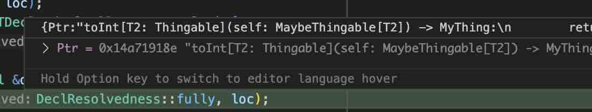
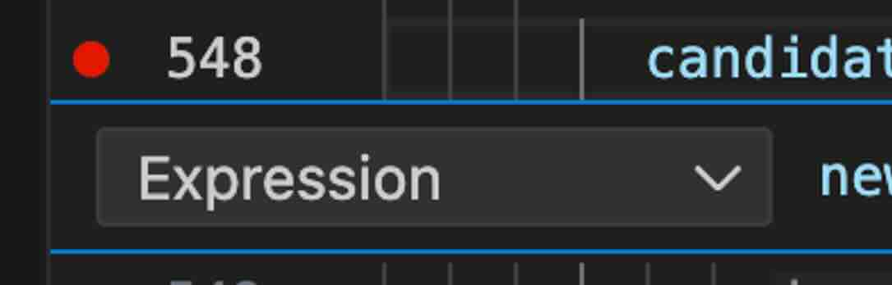
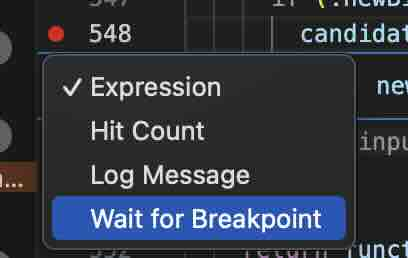
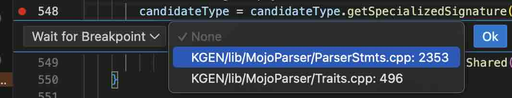
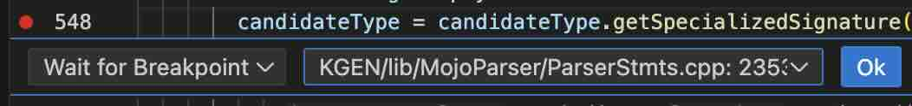

# Parser Debugging

This doc has various tricks to help you debug the parser.

Your four best friends:

- Add a breakpoint on `mlir::emitError` to break on any compile error that gets
  fully emitted (”emitError” isn’t enough, because many diagnostics are formed,
  then abandoned).
- A lot of types have a `.dump()` method that prints to stdout.
- A lot of types have a `.getLoc()` which says where the thing is in the .mojo
  source. Locations are `char*` so you can `print somedecl.getLoc()` to see
  where it is in the source code.
- `ASTDecl` has a `.getUserNameIfOperation()` with the name of the
  struct/function/etc.

Details on these, and other tricks, are below!

## Running the Debugger

[https://github.com/modularml/modular/blob/main/docs/internal/bazel.md#running-targets-or-tests-with-lldb](https://github.com/modularml/modular/blob/main/docs/internal/bazel.md#running-targets-or-tests-with-lldb)

For example, this will open the debugger for the `traits_with_builtin.mojo`
test:

```bash
bd //Mojo/tools/kgen-translate -- -import-mojo KGEN/test/mojo-parser/traits_with_builtin.mojo
```

Generally, test files contain a `# RUN:` line which contains the command to add
after `vscode-debug`, like:

```cpp
## RUN: kgen-translate --mojo-disable-builtins -import-mojo %s | FileCheck %s
```

To make it work in vscode, put `--vscode` after the `bd`. For example:

```python
bd --vscode //Mojo/tools/kgen-translate -- -import-mojo KGEN/test/mojo-parser/traits_with_builtin.mojo
```

## Printing

To print an expression or a type or an `ASTDecl`, you can do `whatever.dump()`.

(If `whatever.dump()` gives an error, try `whatever.mlirType.dump()`)

When you have a stack trace open in a VS Code debugger session, it can be
enlightening to call `.dump()`, `getUserNameIfOperation()`, `getDeclName()`, etc
everything in each stack frame until things start to make sense.

You can also print things out directly in code:

```jsx
(llvm::outs() << whatever) << "\n";
```

You can also put it in a string, which can occasionally be useful:

```jsx
std::string str;
llvm::raw_string_ostream(str) << whatever;
```

Some things have an underlying MLIR type which you can be print out directly.
For example, if you have an `ASTType x` and you `llvm::outs() << x << "\n"`, it
will print out:

```python
def(a: bork::Int, b: bork::Bool) -> None
```

But if you do `llvm::outs() << x.mlirType << "\n"` then it will print out
(paraphrased):

```python
!kgen.generator<
  !lit.generator<[2](
    "a": !lit.ref<@bork::@Int, imm *[0,0]> imm_mem,
    "b": !lit.ref<@bork::@Bool, imm *[0,1]> imm_mem
  ) -> !kgen.none>>
```

…which is sometimes more useful for debugging.

## Locations

Expressions, types, `ASTDecl`s, etc. all have getters for location, like
`myThing.getLoc()`.

You can often translate it into something useful with the `translateLocation`
method on a nearby `Diags` or `SharedState`.

For example, in `OverloadSet::filterOverloadSetForValueType`, we
do`getShared().translateLocation(expr->getLoc())` .

These are mostly useful for printing out, such as with `llvm::outs() << ...` .

Some locations are secretly an `mlir::FileLineColLoc` which has some more useful
information:

```cpp
if (auto fileLineColLoc = dyn_cast<mlir::FileLineColLoc>(mlirLoc)) {
  // Prints: /Users/verdagon/modular/KGEN/test/mojo-parser/traits_without_builtin.mojo:24:33
  llvm::outs() << fileLineColLoc.getFilename().str() << ":"
      << fileLineColLoc.getLine() << ":"
      << fileLineColLoc.getColumn() << "\n";
}
```

…though keep in mind, some locations aren’t a `mlir::FileLineColLoc`s.

In VS Code, if you hover over a `SMLoc` local variable, it will show a little
pop up with the Mojo source code starting at that location.



There, hovering `loc` shows the original `toInt[T2: Thingable](...`, in other
words, shows that this location refers to the `toInt` function.

## Breakpoints

If you’re debugging a compile error, you can add a breakpoint on
`mlir::emitError`. If VS Code doesn’t like that, putting a breakpoint in
`InflightDiag::~InflightDiag` (after the early-return) works well too.

Note that these are when the error is ultimately _printed_, not _created_. It
might be better to put a breakpoint in a more specific place. For example, if
you see the error `parameter #0 has 'Zork' type, but value has type 'Bork'` then
it’s likely better to put breakpoints in the places where the “but value has
type” appears (in this case, a few lines in `OverloadFitness.cpp` and
`ParamBindings.cpp`).

If you want a breakpoint somewhere else, getting it to fire at the right time
without false positives (”noise”) can be tricky. For example, if you have this
`zork.mojo`:

```jsx
def zork[T: Copyable]():
  foo[T](1337)
```

and you want to debug the overload resolution for that `foo` call, you might
first try to put a breakpoint in `CallNode::emitIR`. Alas, that breakpoint might
trigger hundreds of times before it gets to your specific `zork` function’s
`foo` call.

To solve this, you can add some if-statements at the top of `CallNode::emitIR`:

```cpp
auto mlirLoc = emitter.shared.translateLocation(getLoc());
if (auto fileLineColLoc = dyn_cast<mlir::FileLineColLoc>(mlirLoc)) {
  if (fileLineColLoc.getFilename().str().find("zork.mojo") != std::string::npos &&
      fileLineColLoc.getLine() == 3) {
    waitForDebuggerToAttach(); // Like a breakpoint, pauses the debugger
  }
}
```

Sometimes, if the condition is simple enough, you can do this without any code
by giving your breakpoint itself a condition:



In Mojo/include/Mojo/Support/Debugging.h there are two helpful methods:

- `waitForDebuggerToAttach` will make the current debugging session pause, like
  a breakpoint.
- `attachToNewRemoteDebugSession` will start a new debugging session, if there’s
  a VS Code window open and the Mojo extension is installed.

## Waiter Breakpoints

This is an alternative to the above method of testing `getLoc()`.

Same situation: we want the debugger to pause in `CallNode::emitIR` but only for
`zork`'s call to `foo`.

First, add a `__pleaseBreak` declaration to your code, like this:

```jsx

def zork[T: Copyable]():
  var __pleaseBreak: Int = 42
  foo[T](1337)
```

Then put this at the end of `parseVarStmt`:

```jsx
if (name == "__pleaseBreak") {
 (void)[](){}; // put breakpoint here
}
```

And put a breakpoint in there.

Now, make your `CallNode::emitIR` breakpoint “wait for breakpoint”:



and tell it to wait for the one in `parseVarStmt`:





Be sure to hit the Ok button, it’s easy to forget.

Now:

- Start the debugger.
- It will pause at the `parseVarStmt` breakpoint. Hit continue.
- It will pause at the `CallNode::emitIR` breakpoint, as desired.

## Reduce Noise by Simplifying Your Test

If you’re experiencing a lot of breakpoint noise, where your breakpoint is
getting triggered by a lot of unrelated operations, another alternative is to
aggressively reduce and simplify your test case.

For example, try taking out the standard library and builtins by passing
`kgen-translate %s --mojo-disable-builtins -import-mojo`. This might require
some effort, because things like `Optional`, `List`, and even `Int` won’t be
available. Look at `KGEN/test/test-packages/std/builtin/stubs.mojo` for
inspiration on how to nicely fake those.

For an example, see `KGEN/test/mojo-parser/trait_metatype_roundtrip.mojo`.

Caveat: The Mojo compiler hard-codes `AnyType`, so if you make your own trait
named `AnyType` it might not work as expected. Also, Mojo secretly automatically
makes everything _explicitly_ conform to `AnyType`.

## Debug Printing

See
[Mojo Dev Tools](https://www.notion.so/modularai/Mojo-Dev-Tools-027879ef5e4d480ea6f8f73b1cbc2ad3)
for various ways to print out the IR after various passes in the compiler. My
personal favorite is `kgen --mlir-print-ir-after-all` which prints out the IR
after every single pass.

You can also pretty-print location information by making a custom pass, like
described
[here](https://modular-ai.slack.com/archives/C034YPTTKL2/p1730758401416679).
