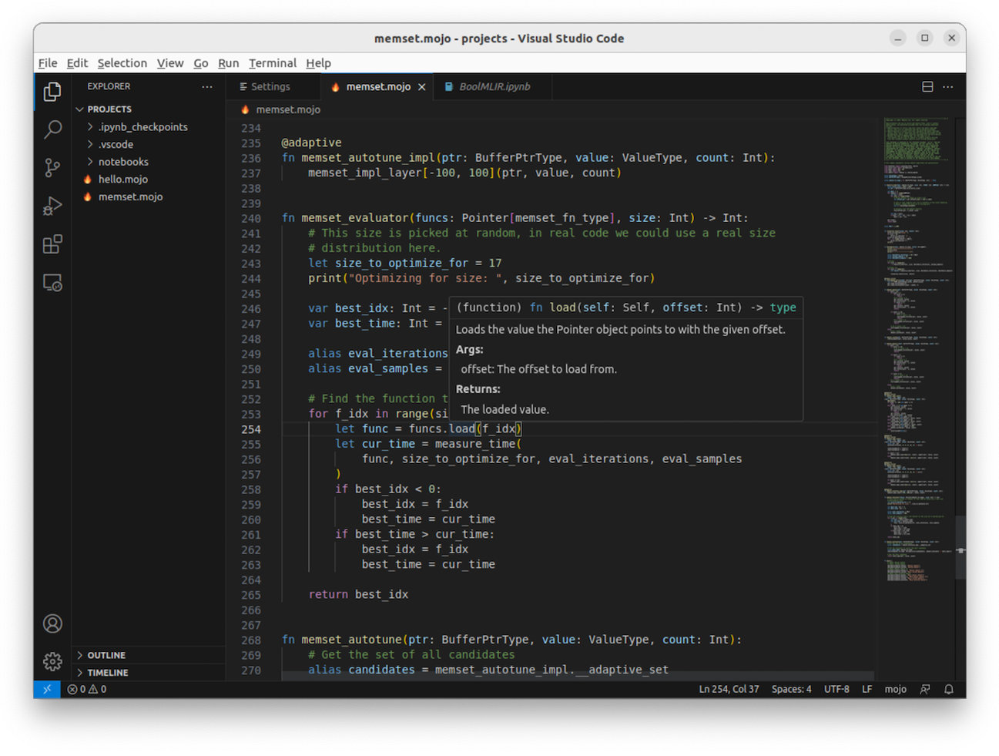

import Tabs from '@theme/Tabs';
import TabItem from '@theme/TabItem';

On this page, we'll show you how to install Mojo and create the classic "Hello
world" starter program with Mojo, in three different ways. If you'd rather read
how to write Mojo code beyond just printing text, see the [introduction to
Mojo](/mojo/manual/basics).

:::tip Updating?

If you already installed Mojo, see [how to update](#update-mojo).

:::

## Requirements

<Tabs>
<TabItem value="mac" label="Mac">

- Apple silicon (M1 or M2 processor)
- macOS Ventura (12) or later
- Python 3.8 - 3.11
- Xcode or Xcode Command Line Tools
- [Homebrew](https://brew.sh)

</TabItem>
<TabItem value="linux" label="Linux">

- Ubuntu 20.04/22.04 LTS
- x86-64 CPU (with [SSE4.2 or
  newer](https://www.intel.com/content/www/us/en/support/articles/000057621/processors.html))
  or AWS Graviton2/3 CPU
- Minimum 8 GiB RAM
- Python 3.8 - 3.11
- g++ or clang++ C++ compiler

</TabItem>
<TabItem value="windows" label="Windows">

Windows support is still in development.

In the meantime, you can use Mojo on Windows [with
WSL](https://learn.microsoft.com/en-us/windows/wsl/install), using a compatible
version of Ubuntu (see our requirements for Linux).

</TabItem>
</Tabs>

## 1. Install Mojo

If you already [installed MAX](/max/install), you can [skip to the next
section](#2-run-code-in-the-repl) because MAX includes Mojo.

The Mojo SDK is available as either a stable build or a nightly build.
We strive to release stable builds once a month and release nightly builds as
often as possible (not necessarily every day).

<Tabs>
{/*############################*/}
{/*#### STABLE BUILD SETUP ####*/}
{/*############################*/}
<TabItem value="stable" label="Stable">

1. Open a terminal and install the [`modular`](/cli/) command line tool with
   this helper script:

   ```sh
   curl -s https://get.modular.com | sh -
   ```

    <details>
      <summary>
        Or, click here to see the manual install commands.
      </summary>
      <div>

      <Tabs>
      <TabItem value="mac" label="Mac">

   ```sh
   brew update && brew install modularml/packages/modular
   ```

      </TabItem>
      <TabItem value="linux" label="Linux">

   ```sh
   apt-get install -y apt-transport-https &&
     keyring_location=/usr/share/keyrings/modular-installer-archive-keyring.gpg &&
     curl -1sLf 'https://dl.modular.com/bBNWiLZX5igwHXeu/installer/gpg.0E4925737A3895AD.key' |  gpg --dearmor >> ${keyring_location} &&
     curl -1sLf 'https://dl.modular.com/bBNWiLZX5igwHXeu/installer/config.deb.txt?distro=debian&codename=wheezy' > /etc/apt/sources.list.d/modular-installer.list &&
     apt-get update &&
     apt-get install -y modular
   ```

      </TabItem>
      </Tabs>

      </div>
    </details>

2. Create a virtual environment:

   Because Mojo interoperates with Python,
   it's important to define a predictable Python version and package library to
   use. We suggest you do that with either venv or conda:

    <Tabs>
      <TabItem value="venv" label="venv">

    For most users, we recommend venv (it's included with Python):

    ```sh
    python3 -m venv mojo-venv && source mojo-venv/bin/activate
    ```

      </TabItem>
      <TabItem value="conda" label="conda">

    Only if you already use conda as your preferred environment, we suggest you
    use that:

    ```sh
    conda create -n mojo python=3.10 -y && conda activate mojo
    ```

      </TabItem>
    </Tabs>

3. Install the Mojo SDK:

   ```sh
   modular install mojo
   ```

4. Set environment variables so you can access the [`mojo`](/mojo/cli/) CLI:

    <Tabs>
      <TabItem value="bash" label="Bash">

      If you're using Bash, run this command:

      ```sh
      MOJO_PATH=$(modular config mojo.path) \
        && BASHRC=$( [ -f "$HOME/.bash_profile" ] && echo "$HOME/.bash_profile" || echo "$HOME/.bashrc" ) \
        && echo 'export MODULAR_HOME="'$HOME'/.modular"' >> "$BASHRC" \
        && echo 'export PATH="'$MOJO_PATH'/bin:$PATH"' >> "$BASHRC" \
        && source "$BASHRC"
      ```

      </TabItem>
      <TabItem value="zsh" label="ZSH">

      If you're using ZSH, run this command:

      ```sh
      MOJO_PATH=$(modular config mojo.path) \
        && echo 'export MODULAR_HOME="'$HOME'/.modular"' >> ~/.zshrc \
        && echo 'export PATH="'$MOJO_PATH'/bin:$PATH"' >> ~/.zshrc \
        && source ~/.zshrc
      ```

      </TabItem>
      <TabItem value="fish" label="fish">

      If you're using fish, run this command:

      ```sh
      set MOJO_PATH (modular config mojo.path) \
        && set -Ux MODULAR_HOME $HOME/.modular \
        && fish_add_path $MOJO_PATH/bin
      ```

      </TabItem>
    </Tabs>

</TabItem>
{/*############################*/}
{/*### NIGHTLY BUILD SETUP ####*/}
{/*############################*/}
<TabItem value="nightly" label="Nightly">

:::caution

Nightly builds are not fully tested. They might include incomplete features,
performance regressions, and new bugs. When using code from the
[mojo](https://github.com/modularml/mojo) GitHub repo, be sure you checkout
the `nightly` branch, because the `main` branch might not be compatible with
nightly builds.

:::

1. Open a terminal and install the [`modular`](/cli/) command line tool with
   this helper script (this is the same for stable and nightly builds):

   ```sh
   curl -s https://get.modular.com | sh -
   ```

    <details>
      <summary>
        Or, click here to see the manual install commands.
      </summary>
      <div>

      <Tabs>
      <TabItem value="mac" label="Mac">

    ```sh
    brew update && brew install modularml/packages/modular
    ```

      </TabItem>
      <TabItem value="linux" label="Linux">

    ```sh
    apt-get install -y apt-transport-https &&
      keyring_location=/usr/share/keyrings/modular-installer-archive-keyring.gpg &&
      curl -1sLf 'https://dl.modular.com/bBNWiLZX5igwHXeu/installer/gpg.0E4925737A3895AD.key' |  gpg --dearmor >> ${keyring_location} &&
      curl -1sLf 'https://dl.modular.com/bBNWiLZX5igwHXeu/installer/config.deb.txt?distro=debian&codename=wheezy' > /etc/apt/sources.list.d/modular-installer.list &&
      apt-get update &&
      apt-get install -y modular
    ```

      </TabItem>
      </Tabs>

      </div>
    </details>

2. Create a virtual environment for nightly builds:

   Because Mojo interoperates with Python,
   it's important to define a predictable Python version and package library to
   use. We suggest you do that with either venv or conda:

    <Tabs>
      <TabItem value="venv" label="venv">

    For most users, we recommend venv (it's included with Python):

    ```sh
    python3 -m venv mojo-nightly-venv && source mojo-nightly-venv/bin/activate
    ```

      </TabItem>
      <TabItem value="conda" label="conda">

    Only if you already use conda as your preferred environment, we suggest you
    use that:

    ```sh
    conda create -n mojo-nightly python=3.10 -y && conda activate mojo-nightly
    ```

      </TabItem>
    </Tabs>

3. Install the nightly Mojo SDK:

   ```sh
   modular install nightly/mojo
   ```

4. Set environment variables so you can access the nightly [`mojo`](/mojo/cli/)
   CLI:

    <Tabs>
      <TabItem value="bash" label="Bash">

      If you're using Bash, run this command:

      ```sh
      MOJO_NIGHTLY_PATH=$(modular config mojo-nightly.path) \
        && BASHRC=$( [ -f "$HOME/.bash_profile" ] && echo "$HOME/.bash_profile" || echo "$HOME/.bashrc" ) \
        && echo 'export MODULAR_HOME="'$HOME'/.modular"' >> "$BASHRC" \
        && echo 'export PATH="'$MOJO_NIGHTLY_PATH'/bin:$PATH"' >> "$BASHRC" \
        && source "$BASHRC"
      ```

      </TabItem>
      <TabItem value="zsh" label="ZSH">

      If you're using ZSH, run this command:

      ```sh
      MOJO_NIGHTLY_PATH=$(modular config mojo-nightly.path) \
        && echo 'export MODULAR_HOME="'$HOME'/.modular"' >> ~/.zshrc \
        && echo 'export PATH="'$MOJO_NIGHTLY_PATH'/bin:$PATH"' >> ~/.zshrc \
        && source ~/.zshrc
      ```

      </TabItem>
      <TabItem value="fish" label="fish">

      If you're using fish, run this command:

      ```sh
      set MOJO_NIGHTLY_PATH (modular config mojo-nightly.path) \
        && set -Ux MODULAR_HOME $HOME/.modular \
        && fish_add_path $MOJO_NIGHTLY_PATH/bin
      ```

      </TabItem>
    </Tabs>

</TabItem>
</Tabs>

Now you're ready to go.

## 2. Run code in the REPL

Now that you've installed Mojo, let's write some code!

First, let's use the Mojo
[REPL](https://en.wikipedia.org/wiki/Read%E2%80%93eval%E2%80%93print_loop),
which allows you to write and run Mojo code in a command prompt:

1. To start a REPL session, type `mojo` in your terminal and press
   <kbd>Enter</kbd>.

2. Then type `print("Hello, world!")` and press <kbd>Enter</kbd> twice
(a blank line is required to indicate the end of an expression).

That's it! For example:

```text
$ mojo
Welcome to Mojo! 🔥

Expressions are delimited by a blank line.
Type `:quit` to exit the REPL and `:mojo help repl` for further assistance.

1> print("Hello, world!")
2.
Hello, world!
```

You can write as much code as you want in the REPL. You can press
<kbd>Enter</kbd> to start a new line and continue writing code, and when you
want Mojo to evaluate the code, press <kbd>Enter</kbd> twice. If there's
something to print, Mojo prints it and then returns the prompt to you.

The REPL is primarily useful for short experiments because the code isn't
saved. So when you want to write a real program, you need to write the code in
a `.mojo` source file.

## 3. Run a Mojo file

Now let's write the code in a Mojo source file and run it with the
[`mojo`](/mojo/cli/) command:

1. Create a file named `hello.mojo` (or `hello.🔥`) and add the following code:

   ```mojo
   fn main():
       print("Hello, world!")
   ```

   That's all you need. Save the file and return to your terminal.

2. Now run it with the `mojo` command:

    ```sh
    mojo hello.mojo
    ```

    It should immediately print the message:

    ```text
    Hello, world!
    ```

If this didn't work for you, double-check that your code looks exactly like the
code in step 1, and make sure you correctly installed either [MAX](/max/install)
(which includes Mojo) or [Mojo](#1-install-mojo).

## 4. Build an executable binary

Finally, let's build and run that same code as an executable:

1. Create an executable file with the [`build`](/mojo/cli/build) command:

    ```sh
    mojo build hello.mojo
    ```

    The executable file uses the same name as the `.mojo` file, but
    you can change that with the `-o` option.

2. Then run the executable:

    ```sh
    ./hello
    ```

This creates a statically compiled binary file, so it contains all the code and
libraries it needs to run.

## 5. Install our VS Code extension (optional)

To provide a first-class developer experience with features like code
completion, quick fixes, and hover help, we've created a [Mojo extension for
Visual Studio
Code](https://marketplace.visualstudio.com/items?itemName=modular-mojotools.vscode-mojo).



## Next steps

- If you're new to Mojo, we suggest you learn the language basics in the
  [introduction to Mojo](/mojo/manual/basics).

- If you want to experiment with some code, clone [the Mojo
repo](https://github.com/modularml/mojo/) to try our code examples:

  ```sh
  git clone https://github.com/modularml/mojo.git
  ```

  If you installed the nightly build, also checkout the nightly branch:

  ```sh
  git checkout nightly
  ```

  In addition to several `.mojo` examples, the repo includes [Jupyter
  notebooks](https://github.com/modularml/mojo/tree/main/examples/notebooks#readme)
  that teach advanced Mojo features.

- To see all the available Mojo APIs, check out the [Mojo standard library
  reference](/mojo/lib).

If you have issues during install, check our [known
issues](/mojo/roadmap#mojo-sdk-known-issues).

:::note

To help us improve Mojo, we collect some basic system information and
crash reports. [Learn
more](/mojo/faq#does-the-mojo-sdk-collect-telemetry).

:::

## Update Mojo

To check your current Mojo version, use the `--version` option:

```sh
mojo --version
```

And compare your version to the latest stable version in the [Mojo
changelog](/mojo/changelog). Or if you installed a nightly build, look for
release announcements in [this Discord
channel](https://discord.com/channels/1087530497313357884/1224434323193594059).

If it's time to update, here's what to do:

1. Make sure you have the latest `modular` CLI:

    <Tabs>
    <TabItem value="mac" label="Mac">

    ```sh
    brew update \
      && brew upgrade modular
    ```

    </TabItem>
    <TabItem value="linux" label="Linux">

    ```sh
    sudo apt update \
      && sudo apt install modular
    ```

    </TabItem>
    </Tabs>

2. Update the `mojo` package:

    <Tabs>
    <TabItem value="stable" label="Stable">

    ```sh
    modular update mojo
    ```

    </TabItem>
    <TabItem value="nightly" label="Nightly">

    ```sh
    modular update nightly/mojo
    ```

    </TabItem>
    </Tabs>
