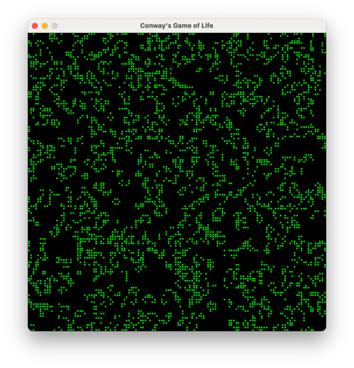

import GetMagic from '@site/src/includes/get_magic.mdx';

Get ready to learn Mojo! This tutorial is designed to give you a tour of several
features of Mojo by building a complete program that does much more than simply
printing "Hello, world!"

In fact, we'll build a version of [Conway's Game of
Life](https://en.wikipedia.org/wiki/Conway%27s_Game_of_Life), which is a simple
simulation to explore self-replicating systems. If you haven't heard of it
before, don't worry, it will make sense when you see it in action. Let's just
get started so you can learn Mojo programming basics, including the following:

- Using basic built-in types like `Int` and `String`
- Using a `List` to manage a sequence of values
- Creating custom types in the form of structs (data structures)
- Creating and importing Mojo modules
- Importing and using Python libraries

This tutorial might be a little long because there's a lot to learn, but we
tried to keep the explanations simple, and we included links along the way for
you to go learn more about each topic.

And if you just want to see the finished code, you can [get it on
GitHub](https://github.com/modularml/mojo/tree/nightly/examples/life).

## 1. Create a Mojo project with `magic`

We'll start by using the [`magic` CLI](/magic) to create a virtual environment
and generate our initial project directory.

<GetMagic />

In your terminal, go to the directory in which you want to create the project
and execute:

```bash
magic init life --format mojoproject
```

This creates a project directory named `life`. Let's go to the directory and
list its contents:

```bash
cd life
```

```bash
ls -A
```

```output
.gitattributes
.gitignore
.magic
magic.lock
mojoproject.toml
```

You should see that the project directory contains:

- An initial `mojoproject.toml` manifest file, which defines the project
  dependencies and other features
- A [lock file](/magic#the-magiclock-file) named `magic.lock`, which specifies
  the transitive dependencies and actual package versions installed in the
  project's virtual environment

  :::note

  Never edit the lock file directly. The `magic` command automatically updates the lock file if you edit the manifest file.

  :::

- A `.magic` subdirectory containing the conda virtual environment for the
  project
- Initial `.gitignore` and `.gitattributes` files that you can optionally use if
  you plan to use `git` version control with the project

Because we used the `--format mojoproject` option when creating the project,
`magic` automatically added the `max` package as a dependency, which includes
Mojo. Let's verify that our project is configured correctly by checking the
version of Mojo that's installed within our project's virtual environment.
`magic run` executes a command in the project's virtual environment, so let's
use it to execute `mojo --version`:

```bash
magic run mojo --version
```

You should see a version string indicating the version of Mojo installed, which
by default should be the latest released version.

Great! Now let's write our first Mojo program.

## 2. Create a "Hello, world" program

You can use any editor or IDE that you like. If you're using [Visual Studio
Code](https://code.visualstudio.com/) you can take advantage of the [Mojo for
Visual Studio Code
extension](https://marketplace.visualstudio.com/items?itemName=modular-mojotools.vscode-mojo),
which provides features like syntax highlighting, code completion, and debugging
support.

In the project directory, create a file named `life.mojo` containing the
following lines of code:

```mojo title="life.mojo"
# My first Mojo program!
def main():
    print("Hello, World!")
```

If you've programmed before in Python, this should look familiar.

- We're using the `def` keyword to define a function named `main`.
- You can use any number of spaces or tabs for indentation as long as you use
  the same indentation for the entire code block. We'll follow the [Python style
  guide](https://peps.python.org/pep-0008/) and use 4 spaces.
- This [`print()`](/mojo/stdlib/builtin/io/print) function a Mojo built-in so it
  doesn't require an import.

An executable Mojo program *requires* you to define a no-argument `main()` as
its entry point. Running the program automatically invokes the `main()`
function, and your program exits when the `main()` function returns.

To run the program, we first need to start a shell session in our project's
virtual environment:

```bash
magic shell
```

Later on, when you want to exit the virtual environment, just type `exit`.

Now we can use the `mojo` command to run our program.

```bash
mojo life.mojo
```

```output
Hello, World!
```

Mojo is a compiled language, not an interpreted one like Python. So when we run
our program like this, `mojo` performs [just-in-time
compilation](https://en.wikipedia.org/wiki/Just-in-time_compilation) (JIT) and
then runs the result.

We can also compile our program into an executable file using [`mojo
build`](/mojo/cli/build) like this:

```bash
mojo build life.mojo
```

By default, this saves an executable file to the current directory named `life`.

```bash
./life
```

```output
Hello, World!
```

## 3. Create and use variables

Let's extend this basic program by prompting the user for their name and
including that in the greeting printed. The built-in
[`input()`](/mojo/stdlib/builtin/io/input) function accepts an optional
[`String`](/mojo/stdlib/collections/string/String) argument to use as a prompt,
and returns a `String` consisting of the characters the user entered (with the
newline character at the end stripped off).

So let's declare a variable, assign the return value from `input()` to it, and
build a customized greeting.

```mojo title="life.mojo"
def main():
    var name: String = input("Who are you? ")
    var greeting: String = "Hi, " + name + "!"
    print(greeting)
```

Go ahead and run it:

```bash
mojo life.mojo
```

```output
Who are you? Edna
Hi, Edna!
```

Notice that this code uses a `String` type annotation indicating the type of
value that the variable can contain. The Mojo compiler performs [static type
checking](https://en.wikipedia.org/wiki/Type_system#Static_type_checking), which
means that you'll encounter a compile-time error if your code tries to assign a
value of one type to a variable of a different type.

Mojo also supports implicitly declared variables, where you simply assign a
value to a new variable without using the `var` keyword or indicating its type.
So we can replace the code we just entered with the following, and it works
exactly the same.

```mojo title="life.mojo"
def main():
    name = input("Who are you? ")
    greeting = "Hi, " + name + "!"
    print(greeting)
```

However, implicitly declared variables still have a fixed type, which Mojo
automatically infers from the initial value assignment. So in this example both
`name` and `greeting` are inferred as `String` type variables. If you then try
to assign an integer value like 42 to the `name` variable, you'll get a
compile-time error because of the type mismatch. You can learn more about Mojo
variables in the [Variables](/mojo/manual/variables) section of the Mojo manual.

## 4. Use Mojo `Int` and `List` types to represent the game state

As originally envisioned by John Conway, the game's "world" is an infinite,
two-dimensional grid of square cells, but for our implementation we'll constrain
the grid to a finite size. A drawback to making the edges of the grid a hard
boundary is that there are fewer neighboring cells around the edges compared to
the interior, which tends to cause die offs. Therefore, we'll model the world as
a toroid (a donut shape), where the top row is considered adjacent to the bottom
row, and the left column is considered adjacent to the right column. This will
come into play later when we implement the algorithm for calculating each
subsequent generation.

To keep track of the height and width of our grid we'll use
[`Int`](/mojo/stdlib/builtin/int/Int), which represents a signed integer of the
[word size](https://en.wikipedia.org/wiki/Word_(computer_architecture)) of the
CPU, typically 32 or 64 bits.

To represent the state of an individual cell, we'll represent the cell state
with an `Int` value of 1 (populated) or 0 (unpopulated). Later, when we need to
determine the number of populated neighbors surrounding a cell, we can simply
add the values of the neighboring cells.

To represent the state of the entire grid, we need a [collection
type](/mojo/manual/types#collection-types). The most appropriate for this use
case is [`List`](/mojo/stdlib/collections/list/List), which is a
dynamically-sized sequence of values.

All of the values in a Mojo `List` must be the same type so that the Mojo
compiler can ensure type safety. (For example, when we retrieve a value from a
`List[Int]`, the compiler knows that the value is an `Int` and can verify that
we then use it correctly). Mojo collections are implemented as [generic
types](https://en.wikipedia.org/wiki/Generic_programming), so that we can
indicate the type of values the specific collection will hold by specifying a
[type parameter](/mojo/manual/parameters/#parameterized-structs) in square
brackets like this:

```mojo
# The List in row can contain only Int values
row = List[Int]()

# The List in names can contain only String values
names = List[String]()
```

We can also create a `List` with an initial set of values and let the compiler
infer the type.

```mojo
nums = List(12, -7, 64)  # A List[Int] containing 3 Int values
```

The Mojo `List` type includes the ability to append to the list, pop values out
of the list, and access list items using subscript notation. Here's a taste of
those operations:

```mojo
nums = List(12, -7, 64)
nums.append(-937)
print("Number of elements in the list:", len(nums))
print("Popping last element off the list:", nums.pop())
print("First element of the list:", nums[0])
print("Second element of the list:", nums[1])
print("Last element of the list:", nums[-1])
```

```output
Number of elements in the list: 4
Popping last element off the list: -937
First element of the list: 12
Second element of the list: -7
Last element of the list: 64
```

We can also nest `List`s:

```mojo
grid = List(
    List(11, 22),
    List(33, 44)
)
print("Row 0, Column 0:", grid[0][0])
print("Row 0, Column 1:", grid[0][1])
print("Row 1, Column 0:", grid[1][0])
print("Row 1, Column 1:", grid[1][1])
```

```output
Row 0, Column 0: 11
Row 0, Column 1: 22
Row 1, Column 0: 33
Row 1, Column 1: 44
```

This looks like a good way to represent the state of the grid for our program.
So let's update the `main()` function with the following code that defines an
8x8 grid containing the initial state of a
"[glider](https://en.wikipedia.org/wiki/Glider_(Conway%27s_Game_of_Life))"
pattern.

```mojo title="life.mojo"
def main():
    num_rows = 8
    num_cols = 8
    glider = List(
        List(0, 1, 0, 0, 0, 0, 0, 0),
        List(0, 0, 1, 0, 0, 0, 0, 0),
        List(1, 1, 1, 0, 0, 0, 0, 0),
        List(0, 0, 0, 0, 0, 0, 0, 0),
        List(0, 0, 0, 0, 0, 0, 0, 0),
        List(0, 0, 0, 0, 0, 0, 0, 0),
        List(0, 0, 0, 0, 0, 0, 0, 0),
        List(0, 0, 0, 0, 0, 0, 0, 0),
    )
```

## 5. Create and use a function to print the grid

Now let's create a function to generate a string representation of the game grid
that we can print it to the terminal.

There are actually two different keywords that we can use to define functions in
Mojo: `def` and `fn`. Using `fn` gives us finer level control over the function
definition, whereas `def` provides a good set of default behaviors for most use
cases.

Let's add the following definition of a function named `grid_str()` to our
program. The Mojo compiler doesn't care whether we add our function before or
after `main()`, but the convention is to put `main()` at the end.

```mojo title="life.mojo"
def grid_str(rows: Int, cols: Int, grid: List[List[Int]]) -> String:
    # Create an empty String
    str = String()

    # Iterate through rows 0 through rows-1
    for row in range(rows):
	      # Iterate through columns 0 through cols-1
        for col in range(cols):
            if grid[row][col] == 1:
                str += "*"  # If cell is populated, append an asterisk
            else:
                str += " "  # If cell is not populated, append a space
        if row != rows-1:
            str += "\n"     # Add a newline between rows, but not at the end
    return str
```

When we pass a value to a Mojo function, the default behavior for `def` is that
an argument is treated as a read-only reference to the value. However, if the
Mojo compiler determines that there is code in the function that can change the
value, then the argument gets a copy of the original value assigned to it. As
we'll see later, we can specify a different behavior by including an explicit
[argument convention](/mojo/manual/values/ownership#argument-conventions). In
contrast, when you define a function with `fn` Mojo simply treats each argument
as a read-only reference by default unless you provide an explicit argument
convention.

Each argument name is followed by a type annotation indicating the type of value
you can pass to the argument. Just like when you're assigning a value to a
variable, you'll encounter a compile-time error if your code tries to pass a
value of one type to an argument of a different type. Finally, the `-> String`
following the argument list indicates that this function has a `String` type
return value.

In the body of the function, we generate a `String` by appending an asterisk for
each populated cell and a space for each unpopulated cell, separating each row
of the grid with a newline character. We use nested `for` loops to iterate
through each row and column of the grid, using
[`range()`](/mojo/stdlib/builtin/range/range) to generate a sequence of integers
from 0 up to but not including the given end value. Then we append the correct
characters to the `String` representation. See [Control
flow](/mojo/manual/control-flow) for more information on `if`, `for`, and other
control flow structures in Mojo.

:::note

As described in [The `for`
statement](/mojo/manual/control-flow#the-for-statement) section of the Mojo
manual, it's possible to iterate over the elements of a `List` directly instead
of iterating over the values of a `range()` and then accessing the `List`
elements by their numeric index. However, iterating over a `List` directly
currently returns a *reference* to the element, which then requires using the
dereference operator, `[]`, to access the actual element value. The code looks
like this:

```mojo
nums = List(12, -7, 64)
for value in nums:
    print("Value:", value[])
```

This behavior is likely to change in the future, at which point iterating over a
`List` won't require using the dereference operator. But for this tutorial,
we'll stick with iterating over a `range()` and accessing the `List` elements by
their numeric index.

:::

Now that we've defined our `grid_str()` function, let's invoke it from `main()`.

```mojo title="life.mojo"
def main():
    ...
    result = grid_str(num_rows, num_cols, glider)
    print(result)
```

Then run the program to see the result:

```bash
mojo life.mojo
```

```output
 *
  *
***


```

We can see that the position of the asterisks matches the location of the 1s in
the `glider` grid.

## 6. Create a module and define a custom type

We're currently passing three arguments to `grid_str()` to describe the size and
state of the grid to print. A better approach would be to define our own custom
type that encapsulates all information about the grid. Then any function that
needs to manipulate a grid can accept just a single argument. We can do this by
defining a Mojo *struct*, which is a custom data structure.

A [Mojo struct](/mojo/manual/structs) is a custom type consisting of:

- Fields, which are variables containing the data associated with the structure
- Methods, which are functions that we can optionally define to manipulate
  instances of the struct that we create

:::note

Mojo structs are similar to classes. However, Mojo structs do *not* support
inheritance. Mojo doesn't support classes at this time.

:::

We could define the struct in our existing `life.mojo` source file, but let's
create a separate *module* for the struct. A module is simply a Mojo source file
containing struct and function definitions that can be imported into other Mojo
source files. To learn more about creating and importing modules, see the
[Modules and packages](/mojo/manual/packages) section of the Mojo manual .

So create a new source file named `gridv1.mojo` in the project directory
containing the following definition of a struct named `Grid` consisting of three
fields:

```mojo title="gridv1.mojo"
@value
struct Grid():
    var rows: Int
    var cols: Int
    var data: List[List[Int]]
```

Mojo requires you to declare all of the fields in the struct definition. You
can't add fields dynamically at run-time. You must declare the type for each
field, but you cannot assign a value as part of the field declaration. Instead,
the [constructor](/mojo/manual/lifecycle/life#constructor) is responsible for
initializing the value of all fields.

Mojo structs support several different [lifecycle
methods](/mojo/manual/lifecycle/) defining the behavior when an instance of the
struct is created, moved, copied, and destroyed. For structs that are basic
aggregations of other types and don't require custom resource management or
lifecycle behaviors, you can simply add the
[`@value`](/mojo/manual/structs#value-decorator) decorator to your struct
definition to have the Mojo compiler automatically generate lifecycle methods
for you.

Because we used the `@value` decorator, `Grid` includes a "member-wise"
[constructor](/mojo/manual/lifecycle/life#constructor) . The constructor's
arguments are the same names and types as the struct's fields and appear in the
same order. So this means that we can create an instance of `Grid` like this:

```mojo
my_grid = Grid(2, 2, List(List(0, 1), List(1, 1)))
```

We can then access the field values with "dot" syntax like this:

```mojo
print("Rows:", my_grid.rows)
```

```output
Rows: 2
```

## 7. Import a module and use our custom `Grid` type

Now let's edit `life.mojo` to import `Grid` from our new module and update our
code to use it.

```mojo title="life.mojo"
from gridv1 import Grid

def grid_str(grid: Grid) -> String:
    # Create an empty String
    str = String()

    # Iterate through rows 0 through rows-1
    for row in range(grid.rows):
	      # Iterate through columns 0 through cols-1
        for col in range(grid.cols):
            if grid.data[row][col] == 1:
                str += "*"  # If cell is populated, append an asterisk
            else:
                str += " "  # If cell is not populated, append a space
        if row != grid.rows - 1:
            str += "\n"     # Add a newline between rows, but not at the end
    return str

def main():
    glider = List(
        List(0, 1, 0, 0, 0, 0, 0, 0),
        List(0, 0, 1, 0, 0, 0, 0, 0),
        List(1, 1, 1, 0, 0, 0, 0, 0),
        List(0, 0, 0, 0, 0, 0, 0, 0),
        List(0, 0, 0, 0, 0, 0, 0, 0),
        List(0, 0, 0, 0, 0, 0, 0, 0),
        List(0, 0, 0, 0, 0, 0, 0, 0),
        List(0, 0, 0, 0, 0, 0, 0, 0),
    )
    start = Grid(8, 8, glider)
    result = grid_str(start)
    print(result)
```

At this point we've made several changes to improve the structure of our
program, but the output should remain the same.

```bash
mojo life.mojo
```

```output
 *
  *
***


```

## 8. Implement `grid_str()` as a method

Our `grid_str()` function is really a utility function unique to the `Grid`
type. So rather than defining it as a standalone function, it makes more sense
to define it as part of the `Grid` type as a method.

To do so, move the function into `gridv1.mojo` and edit it to look like this (or
simply copy the code below into `gridv1.mojo`):

```mojo title="gridv1.mojo"
@value
struct Grid():
    var rows: Int
    var cols: Int
    var data: List[List[Int]]

    def grid_str(self) -> String:
        # Create an empty String
        str = String()

        # Iterate through rows 0 through rows-1
        for row in range(self.rows):
            # Iterate through columns 0 through cols-1
            for col in range(self.cols):
                if self.data[row][col] == 1:
                    str += "*"  # If cell is populated, append an asterisk
                else:
                    str += " "  # If cell is not populated, append a space
            if row != self.rows - 1:
                str += "\n"     # Add a newline between rows, but not at the end
        return str
```

So aside from moving the code from one source file to another, there are a few
other changes that we made.

- The function definition is indented to indicate that it's a method defined by
  the `Grid` struct. This also changes the way that we invoke the function.
  Instead of `grid_str(my_grid)` we now write `my_grid.grid_str()`.
- We've changed the argument name to `self`. When you invoke an instance method,
  Mojo automatically passes the instance as the first argument, followed by any
  explicit arguments that you provide. Although we could use any name we like
  for this argument, the convention is to call it `self`.
- We've deleted the argument's type annotation. The compiler knows that the
  first argument of the method is an instance of the struct, so it doesn't
  require an explicit type annotation.

Now that we've refactored the function into an instance method, we also need to
update the code in `life.mojo` where we invoke it from `main()`:

```mojo title="life.mojo"
def main():
    ...
    start = Grid(8, 8, glider)
    print(start.grid_str())
```

Once again, our refactoring has improved the structure of our code, but it still
produces the same output. You can verify that by running the program again.

## 9. Implement support for the `StringableRaising` trait

You can pass most Mojo types to the built-in `str()` function to produce a
`String` representation of that instance. But you'll get an error if you try to
do that with our current implementation of `Grid`. So let's fix that.

Because the Mojo compiler performs static type checking, a function like `str()`
can accept a value only if its type implements some required behavior—in this
case, it only accepts types that can generate a `String` representation.

To enable that, Mojo supports [*traits*](/mojo/manual/traits). A trait is a set
of requirements in the form of one or more method signatures. A type can
*conform* to that trait by implementing all of the method signatures declared in
the trait. Then we can have a function that indicates that it accepts values of
any type that conform to a specified trait. (This type of function is sometimes
referred to as a [*generic*
function](/mojo/manual/parameters/#parameters-and-generics).)

In the case of `str()`, it requires a type to conform to either the `Stringable`
or `StringableRaising` trait. Each trait requires a conforming type to implement
a `__str__()` method that returns a `String` representation. The only difference
between the two traits is that `Stringable` requires that the method *cannot*
raise and error, whereas `StringableRaising` indicates that the method *might*
raise an error. (To learn more, read [The `Stringable`, `Representable`, and
`Writable`
traits](/mojo/manual/traits#the-stringable-representable-and-writable-traits).)

Our `grid_str()` method already returns a `String` representation, so it looks
like we just have to rename it to `__str__()`. But we also need to indicate
which trait `Grid` conforms to. In our case, it's `StringableRaising` because we
used `def` to define the method. If you define a function or method with `def`,
the compiler *always* assumes that the function *can* raise an error. In
contrast, if you define a function or method with `fn` you must explicitly
indicate with a `raises` keyword if it can raise an error.

So in `gridv1.mojo` we need to update the `Grid` declaration to indicate that
the type conforms to `StringableRaising` and rename the `grid_str()` method to
`__str__()`:

```mojo title="gridv1.mojo"
@value
struct Grid(StringableRaising):
    ...
    def __str__(self) -> String:
        ...
```

Now let's verify that `str()` works with an instance of `Grid`.

```mojo title="life.mojo"
def main():
    ...
    start = Grid(8, 8, glider)
    print(str(start))
```

If you run the program again, you should still see the same glider pattern as before.

```bash
mojo life.mojo
```

```output
 *
  *
***


```

## 10. Implement methods to support indexing

Looking at the implementation of `__str__()` you'll notice that we use
`self.data[row][col]` to retrieve the value of a cell in the grid. And if
`my_grid` is an instance of `Grid`, we would use `my_grid.data[row][col]` to
refer to a cell in the grid. This breaks a fundamental principle of
encapsulation in that we need to know that `Grid` stores the game state in a
field called `data`, and that field is a `List[List[Int]]`. If we later decide
to change the internal implementation of `Grid`, then there could be a lot of
code that would need to be changed.

A cleaner approach is to provide "getter" and "setter" methods to access cell
values. We could simply define methods like `get_cell()` and `set_cell()`, but
this is a good opportunity to show how we can define the behavior of built-in
operators for custom Mojo types. Specifically, we'll implement support for
indexing, so that we can refer to a cell with syntax like `my_grid[row, col]`.
This will be useful when we implement support for evolving the state of the
grid.

As described in [Operators, expressions, and dunder
methods](/mojo/manual/operators), Mojo allows us to define the behavior of many
of the built-in operators for a custom type by implementing special *dunder*
(double underscore) methods. In the case of indexing, the two methods are
`__getitem__()` and `__setitem__()`. So let's add the following methods to the
`Grid` struct in `gridv1.mojo`:

```mojo title="gridv1.mojo"
@value
struct Grid(StringableRaising):
    ...
    def __getitem__(self, row: Int, col: Int) -> Int:
        return self.data[row][col]

    def __setitem__(mut self, row: Int, col: Int, value: Int) -> None:
        self.data[row][col] = value
```

The implementation of `__getitem__()` is easy. For the given values of `row` and
`col` we just need to retrieve and return the corresponding value from the
nested `List[List[Int]]` stored in the `data` field of the instance.

The body of `__setitem__()` is similarly straightforward. We just take the given
`value` and store it in the corresponding `row` and `col` in `data`. One thing
new in the declaration is that we set the return type to `None` to indicate that
the method doesn't have a return value. But more notable is that we've added the
`mut` [argument convention](/mojo/manual/values/ownership#argument-conventions)
to the `self` argument to explicitly tell the Mojo compiler that we want to
mutate the state of the current instance. If we were to omit `mut`, we would get
an error because the compiler would default to read-only access for the
argument.

Now that we've implemented these methods, we can update `__str__()` to use
indexing syntax to access the cell value.

```mojo title="gridv1.mojo"
@value
struct Grid(StringableRaising):
    ...
    def __str__(self) -> String:
        ...
            # Iterate through columns 0 through cols-1
            for col in range(self.cols):
                if self[row, col] == 1:
                    ...
```

<details>
  <summary>Click here to see the complete `gridv1.mojo` so far:</summary>

```mojo title="gridv1.mojo"
import random

@value
struct Grid(StringableRaising):
    var rows: Int
    var cols: Int
    var data: List[List[Int]]

    def __str__(self) -> String:
        # Create an empty String
        str = String()

        # Iterate through rows 0 through rows-1
        for row in range(self.rows):
            # Iterate through columns 0 through cols-1
            for col in range(self.cols):
                if self[row, col] == 1:
                    str += "*"  # If cell is populated, append an asterisk
                else:
                    str += " "  # If cell is not populated, append a space
            if row != self.rows - 1:
                str += "\n"     # Add a newline between rows, but not at the end
        return str

    def __getitem__(self, row: Int, col: Int) -> Int:
        return self.data[row][col]

    def __setitem__(mut self, row: Int, col: Int, value: Int) -> None:
        self.data[row][col] = value
```

</details>

Our refactoring hasn't changed our program's behavior, but it's still a good
idea to run it to be sure that we don't have any errors in our code.

## 11. Define a static method to generate random grids

So far, we've used the glider to build the basic functionality of our `Grid`
type. But what's much more interesting is to start with a grid in a random state
and see how it evolves over time.

Let's add a *static method* named `random()` to the `Grid` struct to generate
and return an instance of `Grid` with a random state. A static method doesn't
operate on specific instances of the type, so it can be invoked as a utility
function. We indicate that a method is a static method by using the
`@staticmethod` decorator.

```mojo title="gridv1.mojo"
import random

@value
struct Grid(StringableRaising):
    ...
    @staticmethod
    def random(rows: Int, cols: Int) -> Self:
        # Seed the random number generator using the current time.
        random.seed()

        data = List[List[Int]]()

        for row in range(rows):
            row_data = List[Int]()
            for col in range(cols):
                # Generate a random 0 or 1 and append it to the row.
                row_data.append(int(random.random_si64(0, 1)))
            data.append(row_data)

        return Self(rows, cols, data)
```

At the top of the file we're importing the `random` package from the Mojo
standard library. It includes several functions related to random number
generation.

By default, the [pseudorandom number
generator](https://en.wikipedia.org/wiki/Pseudorandom_number_generator) used by
the Mojo standard library currently uses a fixed seed. This means that it
generates the same sequence of numbers unless you provide a different seed,
which is useful for testing purposes. But for this application we want to call
`random.seed()` to set a seed value based on the current time, which gives us a
unique value every time.

Then we create an empty `List[List[Int]]` that we populate with a random initial
state. For each cell, we call
[`random.random_si64()`](/mojo/stdlib/random/random/random_si64), which returns
a random integer value from the provided minimum and maximum values of 0 and 1,
respectively. This function actually returns a value of type `Int64`, which is a
signed 64-bit integer value. As described in [Numeric
types](/mojo/manual/types#numeric-types), this is *not* the same as the `Int`
type whose precision is dependent on the native word size of the system.
Therefore we're passing this value to the built-in
[`int()`](/mojo/stdlib/builtin/int/int-function/) function, which explicitly
converts a numeric value to an `Int`.

The return type of the method is `Self`, which is an alias for the type of the
struct. This is a convenient shortcut if the actual name of the struct is long
or includes parameters.

The last line uses `Self()` to invoke the struct's constructor and return a
newly created instance with random data.

Now we can update the `main()` function in `life.mojo` to create a random `Grid`
and print it.

```mojo title="life.mojo"
...

def main():
    start = Grid.random(8, 16)
    print(str(start))
```

Run the program a few times to verify that it generates a different grid each
time.

```bash
mojo life.mojo
```

```output
*** *      ****
*  ****   ******
* * *****
*  * ** **
 *    * ** ****
* **  * * * ***
 * * **  **  **
  * ***** **
```

## 12. Implement a method to evolve the grid

It's finally time to let our world evolve. We'll implement an `evolve()` method
to calculate the state of the grid for the next generation. One option would be
to do an in-place modification of the existing `Grid` instance. But instead
we'll have `evolve()` return a new instance of `Grid` for the next generation.

```mojo title="gridv1.mojo"
...
struct Grid(StringableRaising):
    ...
    def evolve(self) -> Self:
        next_generation = List[List[Int]]()

        for row in range(self.rows):
            row_data = List[Int]()

            # Calculate neighboring row indices, handling "wrap-around"
            row_above = (row - 1) % self.rows
            row_below = (row + 1) % self.rows

            for col in range(self.cols):
                # Calculate neighboring column indices, handling "wrap-around"
                col_left = (col - 1) % self.cols
                col_right = (col + 1) % self.cols

                # Determine number of populated cells around the current cell
                num_neighbors = (
                    self[row_above, col_left]
                    + self[row_above, col]
                    + self[row_above, col_right]
                    + self[row, col_left]
                    + self[row, col_right]
                    + self[row_below, col_left]
                    + self[row_below, col]
                    + self[row_below, col_right]
                )

                # Determine the state of the current cell for the next generation
                new_state = 0
                if self[row, col] == 1 and (num_neighbors == 2 or num_neighbors == 3):
                    new_state = 1
                elif self[row, col] == 0 and num_neighbors == 3:
                    new_state = 1
                row_data.append(new_state)

            next_generation.append(row_data)

        return Self(self.rows, self.cols, next_generation)
```

We start out with an empty `List[List[Int]]` to represent the state of the next
generation. Then we use nested `for` loops to iterate over each row and each
column of the existing `Grid` to determine the state of each cell in the next
generation.

For each cell in the grid we need to count the number of populated neighboring
cells. Because we're modeling the world as a toroid, we need to consider the top
and bottom rows as adjacent and the left-most and right-most columns as
adjacent. So as we iterate through each row and column, we're using the modulo
operator, `%`, to handle "wrap-around" when we calculate the indices of the rows
above and below and the columns to the left and right of the current cell. (For
example, if there are 8 rows, then `-1 % 8` is 7.)

Then we apply the Game of Life rules that determines if the current cell is
populated (1) or unpopulated (0) for the next generation:

- A populated cell with either 2 or 3 populated neighbors remains populated in
  the next generation
- An unpopulated cell with exactly 3 populated neighbors becomes populated in
  the next generation
- All other cells become unpopulated in the next generation

After calculating the state of the next generation, we use `Self()` to create an
new instance of `Grid`, and return the newly created instance.

Now that we can evolve the grid, let's use it in `life.mojo`. We'll add a
`run_display()` function to control the game's main loop:

- Display the current `Grid`
- Prompt the user to continue or quit
- Break out of the loop if the user enters `q`
- Otherwise, calculate the next generation and loop again

Then we'll update `main()` to create a random initial `Grid` and pass it to
`run_display()`. Here is the updated version of `life.mojo`:

```mojo title="life.mojo"
from gridv1 import Grid

def run_display(owned grid: Grid) -> None:
    while True:
        print(str(grid))
        print()
        if input("Enter 'q' to quit or press <Enter> to continue: ") == "q":
            break
        grid = grid.evolve()

def main():
    start = Grid.random(16, 16)
    run_display(start)
```

Run the program and verify that each call to `evolve()` successfully produces a
new generation.

So now we have a working version of the Game of Life, but the terminal interface
is not very pretty. Let's spice things up with a nicer graphical user interface,
using a Python library.

## 13. Import and use a Python package

Mojo lets you import Python modules, call Python functions, and interact with
Python objects from Mojo code. To demonstrate this capability, we're going to
use a Python package called [pygame](https://www.pygame.org) to create and
manage a graphical user interface for our Game of Life program.

First, we need to update our `mojoproject.toml` file to add a dependency on
Python and the `pygame` package. So in the project directory, execute the
following command from the terminal:

```bash
magic add "python>=3.11,<3.13" "pygame>=2.6.1,<3"
```

:::note

When you use Python code and packages as part of your Mojo program, you create a
run-time dependency on a compatible Python runtime and packages. Building an
executable version of your program with `mojo build` does *not* incorporate a
Python runtime or Python packages into the resulting executable file. These
run-time Python dependencies must be provided by the environment where you run
the executable. The easiest way to ensure this requirement is to deploy and run
your Mojo executable in a virtual environment, such as one managed by
[Magic](/magic/) or [conda](https://docs.conda.io/).

:::

You can import a Python module in Mojo using
[`Python.import_module()`](/mojo/stdlib/python/python/Python#import_module).
This returns a reference to the module in the form of a `PythonObject` wrapper.
You must store the reference in a variable so that you can then access the
functions and objects in the module. For example:

```mojo
from python import Python

def run_display():
    # This is roughly equivalent to Python's `import pygame`
    pygame = Python.import_module("pygame")
    pygame.init()
```

:::note

Because Mojo doesn't support globally scoped variables, you must either import a
Python module into each Mojo function that needs to use it or else pass the
`PythonObject` wrapped module as an argument between functions.

:::

You can learn more about importing and using Python modules in Mojo by reading
[Python integration](/mojo/manual/python/).

Once we import `pygame`, we can call its APIs as if we were writing Python code.
For this project, we'll use `pygame` to create a new window and draw the whole
game UI. This requires a complete rewrite of the `run_display()` function. Take
a look at the updated code for `life.mojo` and we'll explain more of it below:

```mojo title="life.mojo"
from gridv1 import Grid
from python import Python
import time

def run_display(
    owned grid: Grid,
    window_height: Int = 600,
    window_width: Int = 600,
    background_color: String = "black",
    cell_color: String = "green",
    pause: Float64 = 0.1,
) -> None:
    # Import the pygame Python package
    pygame = Python.import_module("pygame")

    # Initialize pygame modules
    pygame.init()

    # Create a window and set its title
    window = pygame.display.set_mode((window_height, window_width))
    pygame.display.set_caption("Conway's Game of Life")

    cell_height = window_height / grid.rows
    cell_width = window_width / grid.cols
    border_size = 1
    cell_fill_color = pygame.Color(cell_color)
    background_fill_color = pygame.Color(background_color)

    running = True
    while running:
        # Poll for events
        event = pygame.event.poll()
        if event.type == pygame.QUIT:
            # Quit if the window is closed
            running = False
        elif event.type == pygame.KEYDOWN:
            # Also quit if the user presses <Escape> or 'q'
            if event.key == pygame.K_ESCAPE or event.key == pygame.K_q:
                running = False

        # Clear the window by painting with the background color
        window.fill(background_fill_color)

        # Draw each live cell in the grid
        for row in range(grid.rows):
            for col in range(grid.cols):
                if grid[row, col]:
                    x = col * cell_width + border_size
                    y = row * cell_height + border_size
                    width = cell_width - border_size
                    height = cell_height - border_size
                    pygame.draw.rect(
                        window, cell_fill_color, (x, y, width, height)
                    )

        # Update the display
        pygame.display.flip()

        # Pause to let the user appreciate the scene
        time.sleep(pause)

        # Next generation
        grid = grid.evolve()

    # Shut down pygame cleanly
    pygame.quit()

def main():
    start = Grid.random(128, 128)
    run_display(start)
```

Each argument for `run_display()` other than `grid` has a default value
associated with it (for example, the default `window_height` is 600 pixels). If
you don't explicitly pass a value for an argument when you invoke
`run_display()`, Mojo uses the default value specified in the function
definition.

After importing the `pygame` module, we call `pygame.init()` to initialize all
the pygame subsystems.

The `set_mode()` function creates and initializes a window, with the height and
width passed as a Mojo tuple of two values. This returns a
[`PythonObject`](/mojo/stdlib/python/python_object/PythonObject) wrapper for the
window, which we can then use to call functions and set attributes to manipulate
the window. (For more information about interacting with Python objects from
Mojo, see [Python types](/mojo/manual/python/types).)

The bulk of the `run_display()` function is a loop that uses `pygame` to poll
for events like key presses and mouse clicks. If it detects that the user
presses `q` or the `<Escape>` key or closes the display window, it ends the
program with `pygame.quit()`. Otherwise, it clears the window and then iterates
through all cells in the grid to display the populated cells. After sleeping for
`pause` seconds, it evolves the grid to the next generation and loops again.

So it's finally time to try it out.

```bash
mojo life.mojo
```

Now when you run the program you should see a new window appear on screen
displaying your evolving grid. We now have a fully functional implementation of
the Game of Life with a nice interface. We've come quite a way from just
displaying a few asterisks on the terminal!



To quit the program press the `q` or `<Escape>` key, or close the window.

And now that we're done with the tutorial, exit our project's virtual
environment:

```bash
exit
```

## Summary

Congratulations on writing a complete Mojo application from scratch! Along the
way, you got a taste of:

- Using Magic to create, build, and run a Mojo program
- Using Mojo built-in types like `Int`, `String`, and `List`
- Creating and using variables and functions
- Using control structures like `if`, `while`, and `for`
- Defining and using a custom Mojo struct
- Creating and importing a Mojo module
- Using modules from the Mojo standard library
- Importing and using a Python module

## Next steps

The [Mojo manual](/mojo/manual/) and the Mojo standard library [API
reference](/mojo/lib) contains much more information about these and other
features of Mojo programming. These resources will help prepare you to take full
advantage of the [MAX platform](/max/) to build and deploy high-performance AI
pipelines.
