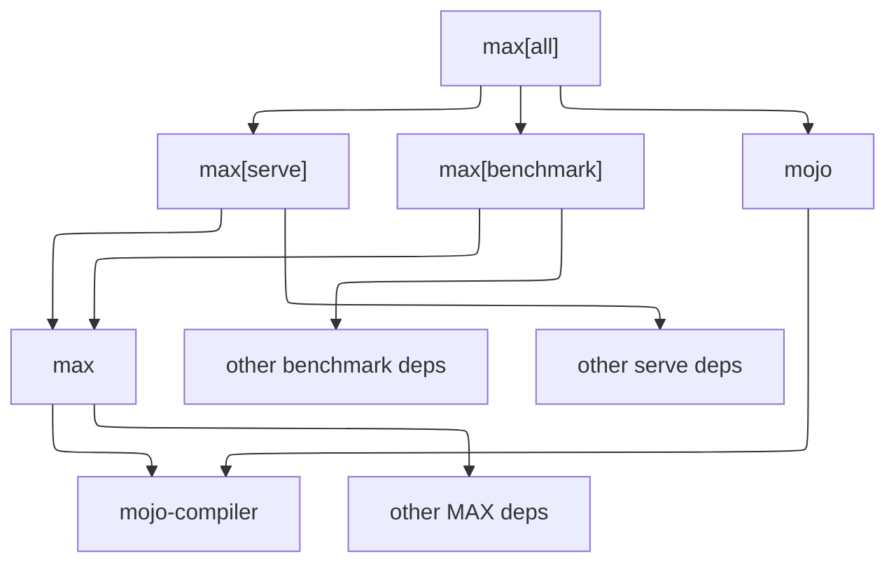

import InstallMAX from './_includes/install-modular.mdx';
import Tabs from '@theme/Tabs';
import TabItem from '@theme/TabItem';
import Requirements from '@site/src/components/Requirements';
import { requirementsNoGPU } from './requirements';

You can install all the MAX API libraries and tools, including Mojo and all
optional dependencies, with `max[all]` (pip/uv) or `max-all` (conda/pixi).
Alternatively, you can install just a subset of the tools using one of the
other `max` package options as described below.

:::tip

If you just want to get started, instead see the
[quickstart guide](/get-started/).

:::

## Install

To get the latest improvements and new features, we recommend
installing our nightly build, which we release several times a week. If you
want a better tested but older version, you can install a stable
build. For version details, see the [release notes](/releases/).

System requirements:

<Requirements requirementsData={requirementsNoGPU}
url="/packages#system-requirements" />

:::tip

We recommend installing with `pixi` for the most reliable experience.

:::

<InstallMAX folder="example-project" />

See the following section for more details about what's included in
`max[all]` (and `max-all`).

:::note GitHub stable branch

If you're using a stable build and want to clone the [Modular
repo](https://github.com/modular/modular), make sure you checkout the `stable`
branch (because the `main` branch includes the latest nightly code). For
example:

```sh
git clone -b stable https://github.com/modular/modular.git
```

:::

## What's included

The `max[all]` (or `max-all`) package includes all optional dependencies so you
can do everything, including serve models, benchmark endpoints, and program
with Mojo.

If you're concerned about bloat in your dependencies, you can chose a
smaller package that includes only what you need. For example, if you only need
to benchmark an endpoint, you can install just `max[benchmark]`.



### `max[all]`

- pip/uv: `max[all]`
- conda/pixi: `max-all`

This is the "all extras" package. It includes everything MAX has to offer.

It's just a convenient way to get all these packages at once:

- `max[benchmark]`
- `max[serve]`
- `mojo`

### `max[benchmark]`

- pip/uv: `max[benchmark]`
- conda/pixi: `max-benchmark`

This is required to use the [`max benchmark`](/cli/benchmark/) command.

It depends on `max` and other third-party packages.

### `max[serve]`

- pip/uv: `max[serve]`
- conda/pixi: `max-serve`

This is required to create an endpoint with the [`max serve`](/cli/serve/)
command.

It depends on `max` and other third-party packages.

### `max`

This is the main package you need to do anything with MAX. It includes:

- [`max` CLI](/cli/): Mostly used to create and benchmark endpoints, but the
  `serve` and `benchmark` commands require `max[serve]` and `max[benchmark]`,
  respectively.
- [MAX Python library](/api/python/): Used to build models.
- [MAX accelerator library](/api/mojo/): Used to accelerate inference with GPUs.
- [MAX Engine C API](/api/c/): Used to run inference without an endpoint.

`max` depends on `mojo-compiler` and minimal third-party packages.

If you want all Mojo developer tools, you must install the larger `mojo`
package, which is included in the `max[all]` package. To see what's in the
`mojo` and `mojo-compiler` packages, see
[what's include in the Mojo SDK](https://mojolang.org/docs/faq/#whats-included-in-the-mojo-sdk).

Technically, there are other packages you'll see in your dependency tree
(such as `max-core`) but they're implementation detail and you should generally
ignore them—don't set them as explicit dependencies in your project because
they won't work on their own.

## System requirements

Your system must meet these specifications.

<Tabs groupId="os">
<TabItem value="mac" label="Mac">

- macOS Sequoia (15) or later.
- Apple silicon (M1–M5 processor).
- Python 3.10–3.14.
- Xcode or Xcode Command Line Tools 16 or later.
- Apple silicon GPU support is available for Mojo GPU programming. See
  [GPU compatibility](#gpu-compatibility) for details. You may need to run
  `xcodebuild -downloadComponent MetalToolchain` to install the Metal utilities
  required for GPU programming.

</TabItem>
<TabItem value="linux" label="Linux">

- glibc 2.34 or later (for example, Ubuntu 22.04 LTS or later).

  :::note Officially supported distribution

  We test MAX on Ubuntu 22.04 LTS or later. Other Linux distributions
  that meet the glibc 2.34+ requirement are expected to work but aren't
  continuously tested.

  :::

- x86-64-v3 (Haswell-class or newer; CPUs from approximately 2013 onward) or
  ARM64 Neoverse N1 or newer (for example, AWS Graviton2 and later).

  :::note x86-64-v3 CPU instruction sets

  The [x86-64-v3 microarchitecture
  level](https://github.com/llvm/llvm-project/blob/main/clang/docs/UsersManual.rst#x86)
  requires AVX, AVX2, BMI1, BMI2, F16C, FMA, LZCNT, MOVBE, and XSAVE
  instructions. To verify your x86-64 CPU on Linux, run
  `cat /proc/cpuinfo | grep flags` and confirm those flags are present.
  This requirement doesn't apply to ARM64 hosts.

  :::

- 8 GiB RAM minimum for Mojo development. MAX inference and model serving
  require significantly more memory, with the exact amount varying by model.
  For the catalog of supported models, see the
  [supported models](/models/) page; for a specific model, check its
  Hugging Face page for memory details.
- Python 3.10–3.14.
- A C compiler (such as `cc`, `gcc`, or `clang`)—used as a linker.
- To use GPUs, see the [GPU compatibility](#gpu-compatibility).

</TabItem>
<TabItem value="windows" label="Windows">

Windows is not officially supported at this time.

In the meantime, you can try MAX on Windows [with
WSL](https://learn.microsoft.com/en-us/windows/wsl/install), using a compatible
version of Ubuntu (see our requirements for Linux).

</TabItem>
</Tabs>

### GPU compatibility

MAX supports both CPUs and GPUs, so you don't always need a GPU to serve a
model. But if you want to accelerate inference with GPUs or program for GPUs
with Mojo, the following GPUs are compatible.

#### NVIDIA GPUs

<table>
  <thead>
    <tr>
      <th>GPU</th>
      <th>Architecture</th>
    </tr>
  </thead>
  <tbody>
    <tr>
      <td colSpan="2"><strong>Tested for serving</strong></td>
    </tr>
    <tr>
      <td>B200</td>
      <td>Blackwell</td>
    </tr>
    <tr>
      <td colSpan="2"><strong>Known compatible for development</strong></td>
    </tr>
    <tr>
      <td>B300</td>
      <td>Blackwell</td>
    </tr>
    <tr>
      <td>B100</td>
      <td>Blackwell</td>
    </tr>
    <tr>
      <td>DGX Spark</td>
      <td>Blackwell</td>
    </tr>
    <tr>
      <td>H200</td>
      <td>Hopper</td>
    </tr>
    <tr>
      <td>H100</td>
      <td>Hopper</td>
    </tr>
    <tr>
      <td>L4</td>
      <td>Ada Lovelace</td>
    </tr>
    <tr>
      <td>L40</td>
      <td>Ada Lovelace</td>
    </tr>
    <tr>
      <td>A100</td>
      <td>Ampere</td>
    </tr>
    <tr>
      <td>A10</td>
      <td>Ampere</td>
    </tr>
    <tr>
      <td>A1000</td>
      <td>Ampere</td>
    </tr>
    <tr>
      <td>RTX 50XX series</td>
      <td>Blackwell</td>
    </tr>
    <tr>
      <td>RTX 40XX series</td>
      <td>Ada Lovelace</td>
    </tr>
    <tr>
      <td>RTX 30XX series</td>
      <td>Ampere</td>
    </tr>
    <tr>
      <td>Jetson Orin / Orin Nano</td>
      <td>Ampere</td>
    </tr>
    <tr>
      <td>Jetson Thor</td>
      <td>Blackwell</td>
    </tr>
    <tr>
      <td>T4</td>
      <td>Turing</td>
    </tr>
    <tr>
      <td>RTX 20XX series</td>
      <td>Turing</td>
    </tr>
  </tbody>
</table>

Software requirement: NVIDIA GPU driver 580 or later. Check your version with
[`nvidia-smi`](https://developer.nvidia.com/system-management-interface). To
update, see the [NVIDIA driver docs](https://www.nvidia.com/en-us/drivers/). If
your driver is older than 580, set the `MODULAR_NVPTX_COMPILER_PATH` environment
variable to a system `ptxas` binary (for example,
`export MODULAR_NVPTX_COMPILER_PATH=/usr/local/cuda/bin/ptxas`).

#### AMD GPUs

<table>
  <thead>
    <tr>
      <th>GPU</th>
      <th>Architecture</th>
    </tr>
  </thead>
  <tbody>
    <tr>
      <td colSpan="2"><strong>Tested for serving</strong></td>
    </tr>
    <tr>
      <td>MI355X</td>
      <td>CDNA4</td>
    </tr>
    <tr>
      <td>MI300X</td>
      <td>CDNA3</td>
    </tr>
    <tr>
      <td>MI325X</td>
      <td>CDNA3</td>
    </tr>
    <tr>
      <td colSpan="2"><strong>Known compatible for development</strong></td>
    </tr>
    <tr>
      <td>MI250X</td>
      <td>CDNA2</td>
    </tr>
    <tr>
      <td>Radeon RX 9070</td>
      <td>RDNA4</td>
    </tr>
    <tr>
      <td>Radeon RX 9060</td>
      <td>RDNA4</td>
    </tr>
    <tr>
      <td>Radeon 880M / 890M</td>
      <td>RDNA3.5</td>
    </tr>
    <tr>
      <td>Radeon 860M</td>
      <td>RDNA3.5</td>
    </tr>
    <tr>
      <td>Radeon 8060S</td>
      <td>RDNA3.5</td>
    </tr>
    <tr>
      <td>Radeon RX 7900</td>
      <td>RDNA3</td>
    </tr>
    <tr>
      <td>Radeon RX 7800 / 7700</td>
      <td>RDNA3</td>
    </tr>
    <tr>
      <td>Radeon RX 7600</td>
      <td>RDNA3</td>
    </tr>
    <tr>
      <td>Radeon 780M</td>
      <td>RDNA3</td>
    </tr>
    <tr>
      <td>Radeon RX 6900</td>
      <td>RDNA2</td>
    </tr>
  </tbody>
</table>

Software requirement: AMD GPU driver 6.3.3 or later (MI355X requires ROCm 7.0 or
later). For installation, see the
[Ubuntu native install guide](https://rocm.docs.amd.com/projects/install-on-linux/en/latest/install/install-methods/package-manager/package-manager-ubuntu.html).

#### Apple silicon GPUs

We're actively developing Apple silicon GPU support (M1–M5), both for GPU
programming with Mojo and for model inference with MAX.

MAX supports a subset of models on Apple silicon today. We've manually run
the [Llama](/api/python/pipelines.architectures.llama3/),
[Gemma](/api/python/pipelines.architectures.gemma3/),
[Nemotron](/api/python/pipelines.architectures.nemotron_h/), and
[FLUX.2](/api/python/pipelines.architectures.flux2/) families, and while Apple
silicon isn't yet covered by the same nightly CI as the GPUs listed above,
support continues to mature.

Quantization moves the memory ceiling significantly; for example, FLUX.2 dev
needs over 120 GB at BF16 and roughly 80 GB at FP4. The FP4 kernels target M5,
and support for other generations is ongoing.

Architectures we haven't exercised on Metal may depend on kernels that don't
exist yet. When that happens, the model fails during graph compilation rather
than at inference time.

For hardware tables and Metal troubleshooting, see
[Mojo system requirements](https://mojolang.org/docs/requirements/#apple-silicon-gpus).

:::note Notes

- Many GPUs are available in variants with different amounts of memory, and
each AI model has different memory requirements. Even if your GPU architecture
is listed as compatible, confirm that the available memory is sufficient for the
model you're using.

- On systems where the GPU shares system RAM (Apple silicon and integrated
GPUs like those in DGX Spark and Strix Halo), a model's weights and activations
have to fit in memory alongside everything else the system is running.

- MAX can serve models on either CPU or GPU, but some models require one or
more GPUs. When you browse our [supported models](/models/), you can check
for multi-GPU support.

- For comprehensive GPU hardware tables, arch targets, and troubleshooting, see
the
[Mojo system requirements](https://mojolang.org/docs/requirements/#gpu-compatibility)
page.

- To deploy MAX in containers, see the [deployment
guide](/serve/local-to-cloud/).

:::
