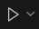
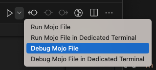
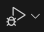
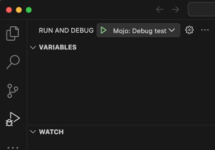
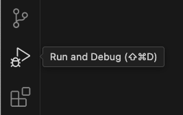
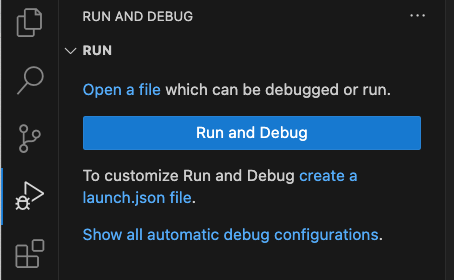
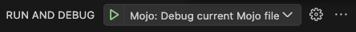
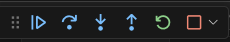
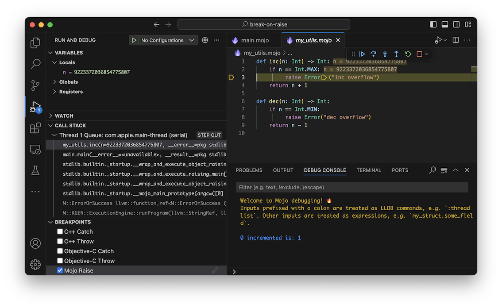
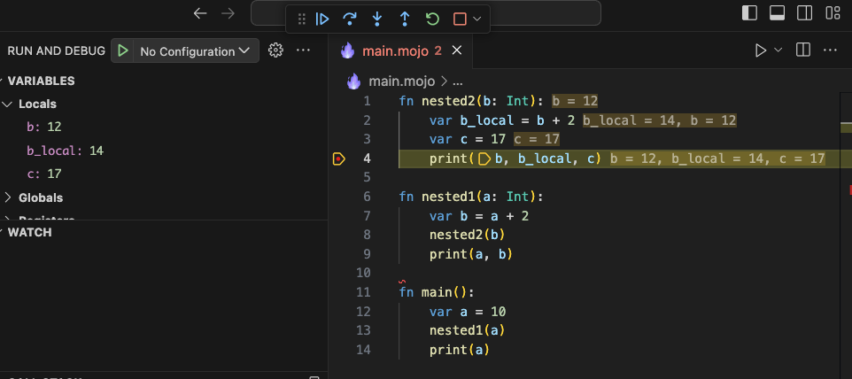

The Mojo extension for Visual Studio Code enables you to use VS Code's built-in
debugger with Mojo programs. (The Mojo extension also supports debugging C, C++,
and Objective-C.)

For complete coverage of VS Code's debugging features, see
[Debugging in Visual Studio Code](https://code.visualstudio.com/docs/editor/debugging).

This page describes the features available through the Mojo extension, as well
as current limitations of the Mojo debugger.

The Mojo SDK includes the [LLDB debugger](https://lldb.llvm.org/) and a Mojo
LLDB plugin. Together these provide the low-level debugging interface for the
Mojo extension. You can also use the `mojo debug` command to start a
command-line debugging session using LLDB or to launch a Mojo debugging session
in VS Code.

## Start debugging

There are several ways to start a debug session in VS Code.

To start debugging, you'll need to have a Mojo project to debug. There are
a number of examples ranging from simple to complex in the [Mojo repo on
GitHub](https://github.com/modularml/mojo).

:::note **VS Code veteran?**

If you're already familiar with debugging in VS Code, the
material in this section will mostly be review. You might want to skip ahead to
[Launch configurations](#launch-configurations)
or see [Using the debugger](#using-the-debugger) for notes on the features
supported in the Mojo debugger.

:::

### Quick run or debug

If your active editor tab contains a Mojo file with an `fn main()` entry point,
one of the quickest ways to run or debug it is using the **Run or Debug** button
in the Editor toolbar.



To start debugging the current file:

* Open the **Run or Debug** dropdown menu and choose **Debug Mojo File** or
  **Debug Mojo File in Dedicated Terminal**.

  

The two debug configurations differ in how they handle input and output:

* **Debug Mojo File** launches the Mojo program detached from any terminal.
  Standard output and standard error output for the program are displayed in the
  **Debug Console**. You can't write to the program's standard input, but you can
  see the program's output and interact with the debugger in a single location.

* **Debug Mojo File in Dedicated Terminal** creates a new instance of VS Code's
  integrated terminal and attaches the program's input and output to the terminal.
  This lets you interact with the program's standard input, standard output and
  standard error output in the terminal, while the **Debug Console** is used only
  for interactions with the debugger.

The **Run or Debug** button uses predefined launch configurations. There's
currently no way to modify the `args`, `env`, `cwd` or other settings for
programs launched with the **Run or Debug** configurations. If you need to
customize any of these things, see [Edit launch
configurations](#edit-launch-configurations).

After you choose one of the debug configurations, the button updates to show
the debug symbol. Click the button to re-run the previous configuration.

.

### Run and Debug view

The **Run and Debug** view includes a button to launch debug sessions and a
menu to select debug configurations. It also has areas to display current
variables, watch expressions, the current call stack, and breakpoints.

<figure>



<figcaption><b>Figure 1.</b> Run and Debug view</figcaption>
</figure>

To open **Run and Debug** view, click the **Run and Debug** icon in the
**Activity Bar** (on the left side of the VS Code window) or press <kbd>Control+Shift+D</kbd>
(<kbd>Command+Shift+D</kbd> on macOS).



If you haven't created any launch configurations in the current project,
VS Code shows the **Run start view**.

<figure>



<figcaption><b>Figure 2.</b> Run start view</figcaption>
</figure>

If you've already launched a debug session or created a `launch.json` file to
define launch configurations, you'll see the **Launch configurations** menu,
which lets you choose configurations and start debug sessions:

<figure>



<figcaption><b>Figure 3.</b> Launch configurations menu</figcaption>
</figure>

### Other ways to start a debug session

There are a number of other ways to start a debug session.

#### Launching from the Command Palette

If you have a Mojo file open in your active editor, you can also start a debug
session from the **Command Palette**.

1. Click **View** > **Command Palette** or press <kbd>Control+Shift+P</kbd>
   (<kbd>Command+Shift+P</kbd> on macOS).

2. Enter "Mojo" at the prompt to bring up the Mojo commands. You should see the
   same debug configurations described in [Quick run or
   debug](#quick-run-or-debug).

#### Launch from the File Explorer

To launch a debug session from the the **File Explorer** view:

1. Right-click on a Mojo file.
2. Select a Mojo debug configuration.

You should see the same debug configurations described in [Quick run or
debug](#quick-run-or-debug).

#### Debug with F5

Press F5 to start a debug session using the current debug configuration.

If you don't have any existing debug configurations available to select, and
your active editor contains a Mojo file with an `fn main()` entry point,
pressing F5 will launch and debug the current file using the **Debug Mojo
File** action described in [Quick run or debug](#quick-run-or-debug).

## Starting the debugger from the command line

Use the `mojo debug` command to start a debug session from the command line. You
can choose from two debugging interfaces:

* With the `--vscode` flag, `mojo debug` starts a debug session on VS Code if
  it's running and the Mojo extension is enabled.

* Without the `--vscode` flag, `mojo debug` starts a command-line [LLDB
  debugger](https://lldb.llvm.org/) session.

You can choose to build and debug a Mojo file, run and debug a compiled binary,
or to attach the debugger to a running process.

:::note Environment variables

When you debug a program from the command line using `--vscode`, the program runs
with the environment variables set in the terminal. When launching from inside
VS Code via the GUI, the environment is defined by the VS Code [launch
configuration](#launch-configurations).

:::

For a full list of command-line options, see the [`mojo debug` reference
page](/mojo/cli/debug).

### Start a debug session from the command line

With VS Code open, run the following command (either from VS Code's integrated
terminal or an external shell):

```bash
mojo debug --vscode myproject.mojo
```

Or to debug a compiled binary:

```bash
mojo debug --vscode myproject
```

For best results, build with the `-O0 -g` command-line options when you build a
binary that you intend to debug—this produces a binary with full debug info.
(When you call `mojo debug` on a Mojo source file, it includes debug
information by default.) See the [`mojo build` reference page](/mojo/cli/build)
for details on compilation options.

### Attach the debugger to a running process from the command line

You can also attach the debugger to a running process by specifying either the
process ID or process name on the command line:

```bash
mojo debug --vscode --pid <PROCESS_ID>
```

Or:

```bash
mojo debug --vscode --process-name <PROCESS_NAME>
```

## Launch configurations

VS Code *launch configurations* let you define setup information for debugging
your applications.

The Mojo debugger provides the following launch configuration templates:

* Debug current Mojo file. Launches and debugs the Mojo file in the active
  editor tab. Effectively the same as the **Debug Mojo File** action described in
  [Quick run or debug](#quick-run-or-debug), but with more configuration options.

* Debug Mojo file. Like the previous entry, except that it identifies a
  specific file to launch and debug, no matter what file is displayed in the
  active editor.

* Debug binary. This configuration operates on a prebuilt binary, which could
  be written in any mixture of languages supported by LLDB (Mojo, C, C++, etc.).
  You need to set the `program` field to the path of your binary.

* Attach to process. Launches a debug session attached to a running process. On
  launch, you choose the process you want to debug from a list of running
  processes.

You can edit any of these templates to customize them. All VS Code launch
configurations must contain the following attributes:

* `name`. The name of the launch configuration, which shows up in the UI (for
  example, "Run current Mojo file").
* `request`. Can be either `launch` (to run a program from VS Code) or `attach`
  (to attach to and debug a running file).
* `type`. Use `mojo-lldb` for the Mojo debugger.

In addition, Mojo launch configurations can contain the following attributes:

* `args`. Any command-line arguments to be passed to the program.
* `cwd`. The current working directory to run the program in.
* `description`. A longer description of the configuration, not shown in the UI.
* `env`. Environment variables to be set before running the program.
* `mojoFile`. Path to a Mojo file to launch and debug.
* `pid`. Process ID of the running process to attach to.
* `program`. Path to a compiled binary to launch and debug, or the
  program to attach to.
* `runInTerminal`. True to run the program with a dedicated terminal, which
  allows the program to receive standard input from the terminal. False to run
  the program with its output directed to the **Debug Console**.

If configuration is a `launch` request, the configuration must include either
the `mojoFile` or `program` attribute.

For `attach` requests, the configuration must include either the `pid` or
`program` attribute.

VS Code performs variable substitution on the launch configurations. You can
use `${workspaceFolder}` to substitute the path to the current workspace, and
`${file}` to represent the file in the active editor tab. For a complete list
of variables, see the VS Code [Variables
reference](https://code.visualstudio.com/docs/editor/variables-reference).

For more information, see the VS Code documentation for [Launch
configurations](https://code.visualstudio.com/docs/editor/debugging#_launch-configurations).

:::note Compilation options

Mojo launch configurations don't allow you to specify compilation options. If
you need to specify compilation options, you can build the binary using [`mojo
build`](/mojo/cli/build), then use a launch configuration with the `program`
option to launch the compiled binary. Or if you [start the debugger from the
command line](#starting-the-debugger-from-the-command-line), you can pass
compilation options to the `mojo debug` command.

:::

### Edit launch configurations

To edit launch configurations:

1. If the **Run and Debug** view isn't already open, click the **Run and
   Debug** icon in the **Activity Bar** (on the left side of the VS Code window)
   or press <kbd>Control+Shift+D</kbd> (<kbd>Command+Shift+D</kbd> on macOS).

   

2. Create or open the `launch.json` file:
   1. If you see the **Run start view**, click **create a launch.json file**.
   2. If you already have launch configurations set up, click the gear icon
      next to the **Launch configurations** menu.
      

3. Select **Mojo** from the list of debuggers.

VS Code opens the new `launch.json` file in an editor tab, with templates for
some common debug actions. Click **Add configuration** to add a new
configuration template.

## Using the debugger

When a debug session is running, use the debug toolbar to pause, continue, and
step through the program.



The buttons on the toolbar are:

* **Continue/Pause**: If the program is stopped, resume the normal execution of the
  program up to the next breakpoint, signal or crash. Otherwise, pause all the
  threads of the program at once.

* **Step Over**: Execute the next line of code without stopping at function calls.

* **Step Into**: Execute the next line of code and stop at the first function call. If the program is stopped just before a function call, steps into the function so you can step through it line-by-line.

* **Step Out**: Finish the execution of the current function and stop right after
  returning to the parent function.

* **Restart**: If this is a `launch` session, terminate the current program and
  restart the debug session. Otherwise, detach from the target process and
  reattach to it.

* **Stop**: If this is a `launch` session, terminate the current program. Otherwise,
  detach from the target process without killing it.

The debugger currently has the following limitations:

* No support for breaking automatically on Mojo errors.

* When stepping out of a function, the returned value is not displayed.

* LLDB doesn't support stopping or resuming individual threads.

### Breakpoints

The Mojo debugger supports setting [standard
breakpoints](https://code.visualstudio.com/docs/editor/debugging#_breakpoints),
[logpoints](https://code.visualstudio.com/docs/editor/debugging#_logpoints),
[function breakpoints](https://code.visualstudio.com/docs/editor/debugging#_function-breakpoints),
[data breakpoints](https://code.visualstudio.com/docs/editor/debugging#_data-breakpoints),
and [triggered breakpoints](https://code.visualstudio.com/docs/editor/debugging#_triggered-breakpoints),
as described in the VS Code documentation.
The Mojo debugger also supports *error breakpoints* (also known as "break on
raise"), which break whenever a `raise` statement is executed.

When debugging Mojo code, the debugger doesn't support conditional breakpoints
based on an expression (it does
support hit counts, which VS Code classifies as a kind of conditional
breakpoint).

When editing a breakpoint, you're offered four options:

* **Expression**. Set a conditional breakpoint (not currently supported).
* **Hit Count**. Add a hit count to a breakpoint (supported).
* **Log Message**. Add a logpoint (supported)
* **Wait for Breakpoint**. Add a triggered breakpoint (supported).

#### Set a hit count breakpoint

A hit count breakpoint is a breakpoint that only breaks execution after the
debugger hits it a specified number of times.

To add a hit count breakpoint:

1. Right click in the left gutter of the editor where you want to place the
   breakpoint, and select **Add Conditional Breakpoint.**
2. Select **Hit Count** from the menu and enter the desired hit count.

To change an existing breakpoint to a hit count breakpoint:

1. Right click on the breakpoint in the left gutter of the editor and select
   **Edit breakpoint**.
2. Select **Hit Count** from the menu and enter the desired hit count.

You can also edit a breakpoint from the **Breakpoints** section of the **Run and
Debug** view:

* Right-click on the breakpoint and select **Edit Condition**, or,
* Click the **Edit Condition** icon next to the breakpoint.

This brings up the same menu, **next to the breakpoint in the editor tab**.

#### Enable error breakpoints

You can enable and disable error breakpoints in VS Code by selecting "Mojo
Raise" in the **Breakpoints** section of the **Run and Debug** view. If enabled
during debugging, executing a `raise` statement causes the debugger to stop
execution and highlight the line of code where the error was raised.



### View local variables

When a program is paused in the debugger, the editor shows local variable values
inline. You can also find them in the **Variables** section of the **Run and
Debug** view.

<figure>



<figcaption><b>Figure 4.</b> Local variable values displayed in the debugger</figcaption>
</figure>

### View the call stack

When a program is paused in the debugger, the **Run and Debug** view shows the
current call stack. (You may see multiple call stacks, one for each active
thread in the program.)

<figure>


<figcaption><b>Figure 5.</b> Call stack in Run and Debug view</figcaption>
</figure>

The **Call Stack** section of the Run and Debug view shows a stack frame for
each function call in the current call stack. Clicking on the name of the
function highlights the current line in that function. For example, in Figure
5, the program is paused at a breakpoint in `nested2()`, but the parent
function, `nested1()` is selected in the call stack. The editor highlights the
current line in `nested1()` (that is, the call to `nested2()`) and shows the
current local variable values for `nested1()`.

### Use the Debug Console

The **Debug Console** gives you a command-line interface to the debugger. The
**Debug Console** processes LLDB commands and Mojo expressions.

Anything prefixed with a colon (`:`) is treated as an LLDB command. Any other
input is treated as an expression.

Currently Mojo expressions are limited to inspecting variables and their fields.
The console also supports subscript notation (`vector[index]`) for certain data
structures in the standard library, including  `List`, `SIMD`,
and `ListLiteral`.

In the future, we intend to provide a way for arbitrary data structures to
support subscript notation in the **Debug Console**.

:::note

The **Debug Console** only accepts input when the program is paused.

:::

## Tips and tricks

There are several features in the standard library that aren't directly related
to the debugger, but which can help you debug your programs. These include:

* Programmatic breakpoints.
* Setting parameters from the Mojo command line.

### Set a programmatic breakpoint

To break at a specific point in your code, you can use the built-in
[`breakpoint()`](/mojo/stdlib/builtin/breakpoint/breakpoint) function:

```mojo
if some_value.is_valid():
   do_the_right_thing()
else:
   # We should never get here!
   breakpoint()
```

If you have VS Code open and run this code in debug mode (either using VS Code
or `mojo debug`), hitting the `breakpoint()` call causes an error, which
triggers the debugger.

:::note Assertions

The [`testing`](/mojo/stdlib/testing/testing/) module includes a number of
ways to specify assertions. Assertions also trigger an error, so can open the
debugger in the same way that a `breakpoint()` call will.

:::

### Set parameters from the Mojo command line

You can use the [`param_env`](/mojo/stdlib/sys/param_env/) module to retrieve
parameter values specified on the Mojo command line. Among other things, this
is an easy way to switch debugging logic on and off. For example:

```mojo
from param_env import is_defined

def some_function_with_issues():
    # ...
    @parameter
    if is_defined["DEBUG_ME"]():
        breakpoint()
```

To activate this code, use the [`-D` command-line
option](/mojo/cli/debug#compilation-options) to define `DEBUG_ME`:

```bash
mojo debug -D DEBUG_ME main.mojo
```

The `is_defined()` function returns a compile-time true or false value based on
whether the specified name is defined. Since the `breakpoint()` call is inside a
[parametric `if` statement](/mojo/manual/decorators/parameter#parametric-if-statement),
it is only included in the compiled code when the `DEBUG_ME` name is defined on
the command line.

## Troubleshooting

### `error: can't connect to the RPC debug server socket`

If using `mojo debug --rpc` gives you the message `error: can't connect to the RPC debug server socket: Connection refused`, try the following possible fixes:

* Make sure VS Code is open.
* If VS Code is already open, try restarting VS Code.
* If there are other VS Code windows open, try closing them and then restarting. This error can sometimes occur when multiple windows have opened and closed in certain orders.

### `error: couldn't get a valid response from the RPC server`

If using `mojo debug --rpc` gives you the message `error: couldn't get a valid response from the RPC server`, try the following possible fixes:

* Make sure VS Code is open to a valid Mojo codebase. This error can sometimes happen if the VS Code window is open to some other codebase.
* If there are multiple VS Code windows open, try closing all but the one you wish to debug in.
* Restart VS Code.
* Reinstall the SDK and restart VSCode.
* If you are working on a development version of the SDK, make sure that all SDK tools are properly built with your build system, and then reload VSCode.
* As a last resort, restarting your entire computer can fix this problem.

If these steps don't help, please file an issue. We'd love your help identifying possible causes and fixes!
