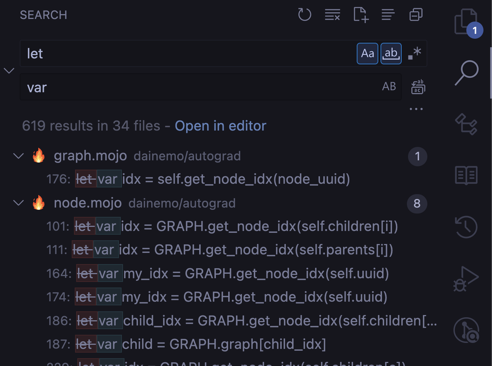
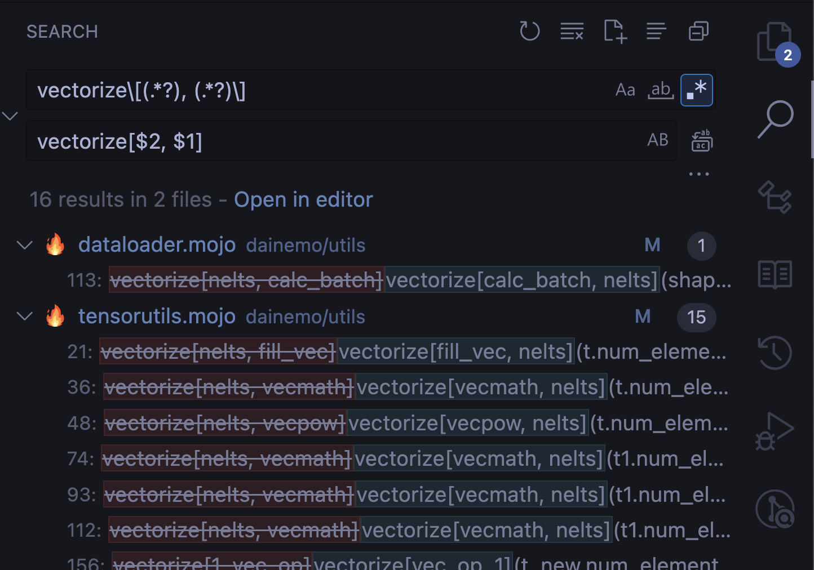
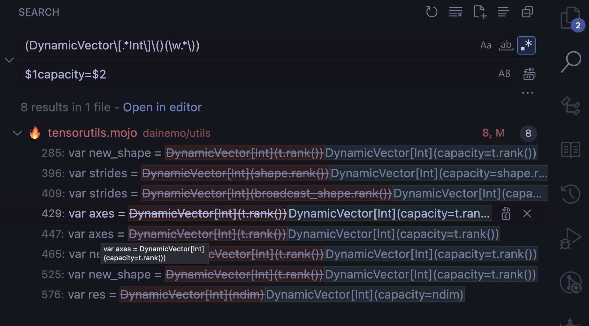

The following update steps are ordered from most to least common. If you have
compiler warnings or errors, you can go down the list and try recompiling your
program after each item.

## Upgrading Mojo 0.7 to 24.1

### Rename `let` to `var`

There is now a compiler warning to change the `let` keyword to `var`. But `let`
is a common word that you might mistakenly overwrite a comment or doc string. VS
Code has a nice `find and replace` feature to visualize the changes before
making them.

First click the search icon and select the icon for Match Whole Word `[ab]`,
then click the arrow to expand the replace bar. Put `let` in the first bar and
`var` in the second, then press enter. You can change one file at a time by
pressing the `Replace All` button next to each file:



### `vectorize()` and `unroll()` signature change

The `vectorize()` function now has the ability to add an `unroll_factor`
parameter to unroll the loop. This will often be used as a keyword parameter for
clarity like this: `vectorize[fn, simd_width, unroll_factor=2](size)`. The `fn`
parameter was moved to the front of the signature to accommodate this.

You can update old code using the find and replace regex syntax to swap the
parameters:

```re
vectorize\[(.*?), (.*?)\]
vectorize[$2, $1]
```

In VS Code back in search, you can press the `.*` icon and paste regex to fix
the signatures:



Similarly, `unroll` has changed to match the vectorize signature, which can be
updated in the same way with the following regex:

```re
unroll\[(.*?), (.*?)\]
unroll[$2, $1]
```

### `vectorize_unroll()` function removed

You must change `vectorize_unroll[width, unroll_factor, fn](size)` to
`vectorize[fn, width, unroll_factor](size)`. The regex for this is:

```re
vectorize_unroll\[(.*?), (.*?), (.*?)\]
vectorize[$3, $1, $2]
```

### `DynamicVector` constructor  `capacity` now keyword-only

The [`DynamicVector`](/mojo/stdlib/collections/list/List) struct had
a constructor that took a single integer value for the vector's capacity. This
had the effect of allowing an implicit conversion from `Int` to `DynamicVector`.
This was not intended to support implicit conversion, so `capacity` is now a
keyword-only argument to avoid this. To update your code you can use this regex:

```re
(DynamicVector\[.*Int\]\()(\w.*\))
$1capacity=$2
```

Which in VS Code looks like this:



### `NDBuffer` signature change

The shape of an
[`NDBuffer`](/mojo/stdlib/buffer/buffer/NDBuffer) can
now default to being unknown, so the parameter list has been rearranged to
accommodate this:

For example this:

```mojo
var buf = NDBuffer[rank, shape, type, address_space]()
```

Becomes this:

```mojo
var buf = NDBuffer[type, rank, shape, address_space]()
```

And the `shape` and `address_space` parameters are now optional:

```mojo
var buf = NDBuffer[type, rank]()
```

The regex to fix this is:

```re
NDBuffer\[(.*?), (.*?), (.*?),
NDBuffer[$3, $1, $2]
```

### Dereference `Variant` with `[]`

Previously, using [`Variant`](/mojo/stdlib/utils/variant/Variant)
was unsafe with heap allocated objects, it now
returns a reference. If you had code that looks like this:

```mojo
from utils import Variant

fn foo(variant: Variant[String, Int]):
    if variant.isa[String]():
        var s = variant.get[String]()
        print(s)

fn main():
    foo(String("foo"))
```

You now need to dereference to get access to the pointed to value with `[]`:

```mojo
        var s = variant.get[String]()
        print(s[])
```

Note that dereferencing with `[]` is temporary, Mojo will add auto-dereferencing
in the future so this is invisible to the user.

### String method changes

Methods on `String` were changed to match Python naming conventions:

```mojo
var s = String("Foo")
var lower = s.tolower()
var upper = s.toupper()
```

Has become:

```mojo
var s = String("Foo")
var lower = s.lower()
var upper = s.upper()
```

The regex to fix this is:

```re
\.tolower\(\)
lower()
```

And:

```re
\.toupper\(\)
upper()
```

### Implicit parameters for arguments

Previously you could explicitly specify the implicit  parameters of an
[automatically parameterized function](/mojo/manual/parameters/#automatic-parameterization-of-functions)
by passing them in the parameter list:

```mojo
fn foo(x: SIMD):
    print(x)

fn main():
    foo[DType.int32, 1](SIMD[DType.int32, 1](4))
```

This was not intended to be possible and is now a compiler error. These implicit
parameters are always inferred from the function arguments. For example:

```mojo
fn foo(x: SIMD):
    print(x)

fn main():
    var v =SIMD[DType.int32, 2](4, 2)
    foo(v)
```

There is no regex to accommodate all the variations of this, so it needs to be
done manually.

### Using a trait inside another trait

This no longer compiles:

```mojo
trait Foo:
    fn foo[T: Bar](self): ...

trait Bar: ...

struct MyStruct(Foo):
    fn foo[T: Bar](self): ...
```

You must use concrete types inside trait methods for now, this was an unintended
regression as our codebase wasn't using this feature, it will be fixed in a
future release.
