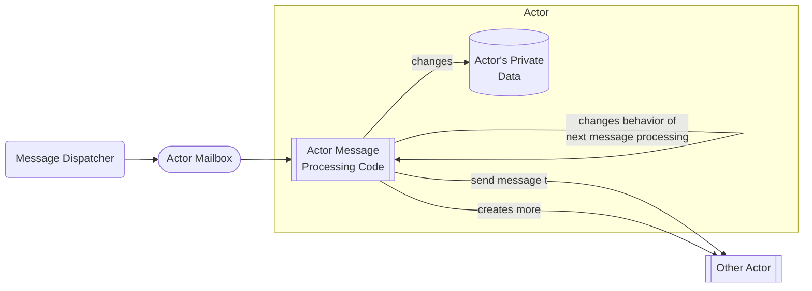

## About Actors
While some familiarity with actors and actor systems is expected in this 
proposal, this section provides a light coverage of actors for the unfamiliar. 
If you are thoroughly versed, you can probably skip this section. 

### Background
Actors have a deep theoretical basis and have been explored by academia since
they were invented in 1973 by Carl Hewitt at MIT.

A full explanation of [the Actor Model is available on Wikipedia](https://en.wikipedia.org/wiki/Actor_model), and there
are other academic references on the [c2 wiki page](http://wiki.c2.com/?ActorsModel). These are good place to 
start reading if you'd like to dive into some of the theoretical
fundamentals that back the actor model.

The actor model also has a proven commercial track record with  [Erlang](https://www.erlang.org) and
[Akka](http://akka.io), which successfully power a large number of highly scalable and reliable
systems. Erlang is used by Ericcson in most of its telecommunications equipment. 
Akka is used by Tesla to [operate a digital twin
system across America for managing its fleet of
Powerwall installations to support load balancing in the power grid](https://blog.isa.org/teslas-virtual-power-plant-re-envisioning-the-electric-grid). Many
banks and other finance companies use actors to handle scale, reliability, and
responsiveness. 

### What Is An Actor?

The Actor Model is a mathematical programming model of concurrent computation that 
treats an actor as the basic building block of concurrent computation. In response
to a message it receives, an actor can only: 
* make local decisions, 
* modify its private data/state (typically but not exclusively memory), 
* create more actors, 
* send a message to another actor, and 
* designate the behavior to be used for the next message it receives. 

Consequently, actors can only affect each other indirectly by sending messages, 
which removes the need for lock-based synchronization between actors. This turns
out to be a large advantage compared to other concurrent computation models.  

Actors are composed of essentially two things:
* State: a discrete, unshared memory area for storing the actor's state
* Behavior: a process or function for handling messages the actor receives

Diagrammatically, it looks like this:

### What Is An Actor System?
An Actor System is the machinery necessary to support a large number of actors 
cooperating to provide aggregate functionality. Actor systems provide the
necessary supporting infrastructure:
* A FIFO queue for the actor's messages (the "mailbox")
* A way to receive messages from actors and place them on the right queue (enqueue)
* A way to deliver messages from a mailbox to the actor (dispatch)
* The guarantee that every actor will only process one message at a time

An interesting property of actor systems is that they can be reliable, too.
It is quite easy to introduce mechanisms for handling and partially
recovering from runtime failures (like failed force-unwrap operations,
out-of-bounds array accesses, divide-by-zero, etc). In the case of Erlang, 
even software updates to the various actors are handled without stopping
the system. 

The final step is to tackle whole system problems by enabling actors
to run in different processes, on different machines, or even across
data centers, while still communicating asynchronously by sending messages.
I'm sure you can see that this will extrapolate out to a number of
interesting long term possibilities.

### Actors Do Not Share State
Each actor completely encapsulates its data. This data must not be shared.  
If you want an actor's data to change, you send it a message and let that
actor decide if, when, and how it changes.

If these conventions are followed strictly (or enforced by a compiler), it
means that:
* there is never any need to use a concurrency primitive (mutex, futex,
  semaphore, etc.)
* you never spend time debugging complicated concurrent thread processing       
  issues
* actor behavior and state changes are very easy to reason about and localized
  in its code

The [Prior Work](https://gist.github.com/lattner/31ed37682ef1576b16bca1432ea9f782) explains the evils of shared state:
* [Shared Mutable State Is Bad For Software Developers](https://gist.github.com/lattner/31ed37682ef1576b16bca1432ea9f782#shared-mutable-state-is-bad-for-software-developers)
* [Shared Mutable State is Bad For Hardware](https://gist.github.com/lattner/31ed37682ef1576b16bca1432ea9f782#shared-mutable-state-is-bad-for-hardware)
* [Shared Mutable State Doesn't Scale Beyond A Single Process](https://gist.github.com/lattner/31ed37682ef1576b16bca1432ea9f782#shared-mutable-state-doesnt-scale-beyond-a-single-process)

### Actors are Asynchronously Message Driven
A message (block of data) is sent asynchronously to an actor to cause an
effect on it. The sender does not wait for a reply.  Replies can be handled
with closures but always occur asynchronously.   Because the actor model
does not specify how messages are to be sent to an actor, but it does
require the actor's processing to be done only in response to messages,
an actor system's transmission of messages can easily scale from very fine
to very large modes of communication.

Consider the following options for message transmission:
1. From one processing unit (e.g. CPU) to another processing unit
  (e.g. GPU) through the system's bus or other internal hardware
  based communication pathway (in a situation where the processing
  units themselves are modeled as actors)
1. At a specific, shared, memory address between two processing units
1. As a parameter to a function designed to receive an actor's messages
1. As a block of data placed into a FIFO queue for asynchronous
  consumption by the actor
1. As a block of data placed in shared memory between actors in separate
  operating system processes on one computer.
1. As a block of data passed from one process to another using inter-process
  communication (IPC) services of an operating system
1. As a block of data serialized and transmitted using a network protocol
  such as UDP, Aeron, TCP, etc.
1. As a block of data placed in a persistent (or not) message queue for
  future consumption by one or more recipients subscribed to that queue,
  asynchronously.

A given implementation of the Actor Model could make use of all 8 of
these transmission mediums depending on the relative "location" of
the actors involved; since actors must support location transparency.

### Actor Messages Use ReferenceCounting and Copy-On-Write
Actors should not be dependent upon the lifetime of externaly provided
messages. However, making a deep copy on each message send is just a
plain waste of time. Consequently, messages should be passed by references
to keep things snappy, but they need to be safe as well. Reference counting
addresses memory safety and lifetime, Copy-On-Write means the actor
cannot screw up data for sender.

### Actors are Type Safe
The external API of an actor is composed of all the messages the actor can
receive. We want this to be a non-empty, finite set of messages represented
by a single type, a sum-type of product-types
([see below](mojo-features-needed.md#sum-type-of-product-types))

### Actors Can Be State Machines
Actors only perform computations in response to a message, and they can change
their behavior (how they will process subsequent message(s)) in response to a
message, actors can be regarded as state machines.  The state of an actor is
the combination of its private data and the current behavior used on the next
message.  Messages sent to an actor take the place of transitions in the state
machine model.  A message, then, can do two important things with respect to
a state machine:
* Completely alter the previous data (state) of the actor including deleting
  all of it and providing a new data shape in its place
* Transition to a new behavioral "state" to dictate how subsequent messages
  will be handled.

Regarding actors as state machines has the following benefits:
* State machines are very well known and frequently used in many knowledge
  domains
* State machines are conceptually simple and do not overburden the code reader
  or writer.
* Despite their simplicity, actors can be used to model very complex
  systems by allowing them to partition the complexity into more
  manageable pieces (actors)

### Actors are Addressable
Every actor has an address that locates it in the computing universe.
Messages are directed to a specific actor by using its address. Clients
of an actor use its address through a facade, an `ActorReference`, to send
messages.

When an actor system provides an effective addressing scheme for actors,
it enables _location transparency_ where actors do not need to know or even
care where the target actor of their message is.  Location transparency offers
these benefits:
* allows actor systems to incorporate diverse sets of hardware, and computing
  infrastructure
* resiliency is enabled simply because the actor instance, referenced by an
  address, can move to alternate and available hardware infrastructure
* similarly, scalability is enabled by actor mobility because clusters of
  actors can be deployed to increasing numbers of physical machines while
  maintaining a facade of a single scalabe computing entity (a cluster of
  nodes)

### Actor processing is side-effect free
Since actor state is private and we intend to make it impossible to break
the encapsulation of it (your program won't compile if you try), message
processing should be considered free of side-effects from the functional
programming point of view. While the actor's behavior may change the 
state of the actor, that is a local effect that has no bearing on anything
else. In other words, the only way to observe the effect is by sending 
another message, or implying the effect in a response message. It can't 
be measured or observable directly. 

A consequence of this is that functional programming enthusiasts can 
and should consider a message send to be equivalent to an asynchronous,
non-blocking, function call.  The sender need not wait for a response
and there may not be a response. If there is a response, it too is sent
by another asynchronous non-blocking message to the sender of the original
message.  
