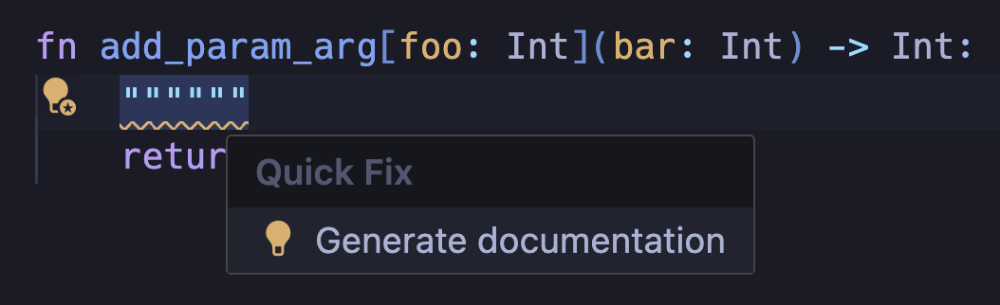

# Coding standards & style guide

This document describes conventions that Mojo standard library code should
adhere to. Its coverage ranges from non-semantic conventions like code
formatting, to semantics like value lifecycle behavior that standard library
types should generally conform to.

## Structure and formatting

### Files & layout

#### File structure

The Mojo standard library uses the following high-level organization:

- Group related functions within the same file.
- Group related files within the same directory.
- Do not add dependencies to the `stdlib` module because, by definition, it is
required to be a leaf dependency.

```text
> stdlib               # stdlib root directory
    > doc              # folder containing markdown documentation
    > scripts          # scripts for compiling and running the tests
    > src              # stdlib mojo source files
        > builtin      # mojo source for stdlib builtins
        > collections  # mojo source for stdlib collections
        > memory       # mojo source for stdlib memory primitives
        ...
    > test             # stdlib unit tests
```

All Mojo source files must end with the extension `.mojo` or `.🔥`.

#### Mojo format

Mojo provides a command line formatting utility, `mojo format`, designed to
automatically format your code according to the official Mojo style guidelines.
It adjusts indentation, spacing, and line breaks, making code more readable and
consistent.

```bash
> mojo format example.mojo
All done! ✨ 🍰 ✨
1 file left unchanged.
```

Unless otherwise noted, Mojo standard library code should follow the formatting
produced by `mojo format`.

#### Whitespace

- Use 4-space indentation.
- Do NOT use Tab characters.
- Use vertical whitespace only as needed to organize code into logical sections.

*We encourage updating your editor settings to be consistent with the above.*

#### Column limit

Mojo code has a column limit (line length) of 80 characters.

#### File license header

Every file in the open source Mojo standard library should begin with the
following license information header:

```mojo
# ===----------------------------------------------------------------------=== #
# Copyright (c) 2024, Modular Inc. All rights reserved.
#
# Licensed under the Apache License v2.0 with LLVM Exceptions:
# https://llvm.org/LICENSE.txt
#
# Unless required by applicable law or agreed to in writing, software
# distributed under the License is distributed on an "AS IS" BASIS,
# WITHOUT WARRANTIES OR CONDITIONS OF ANY KIND, either express or implied.
# See the License for the specific language governing permissions and
# limitations under the License.
# ===----------------------------------------------------------------------=== #
```

#### Code header comments

Code in the Mojo standard library should use the following conventional
structure of header comments separating the various kinds of methods that can be
defined on structs.

```mojo
# ===----------------------------------------------------------------------===#
# MyStruct
# ===----------------------------------------------------------------------===#


struct MyStruct(Sized, Stringable):
    """Description goes here."""

    var field: Int

    # ===------------------------------------------------------------------===#
    # Constructors
    # ===------------------------------------------------------------------===#

    fn __init__(self):
        ...

    # ===------------------------------------------------------------------=== #
    # Trait Interfaces
    # ===------------------------------------------------------------------=== #

    fn __len__(self) -> Int:
        ...

    fn __str__(self) -> String:
        ...

    # ===------------------------------------------------------------------=== #
    # Methods
    # ===------------------------------------------------------------------=== #
```

## Code conventions

### Identifier naming conventions

There are several ways to capitalize and separate words, known as "case
styles." By following the same set of case styles in our code, Mojo developers
ensure their code is accessible and understandable to others in the community.

This first table is just a definition of the various "case styles."

| Case style             | Description                               | Example
|------------------------|-------------------------------------------|-----------------
| `snake_case`           | All lowercase with underscores            | `variable_name`
| `PascalCase`           | Each word starts with an uppercase letter | `StructName`
| `SCREAMING_SNAKE_CASE` | All uppercase with underscores            | `CONSTANT_VALUE`
| `kebab-case`           | All lowercase with hyphens                | `project-name`
| `flatcase`             | All lowercase without separators          | `basename`

The following table shows our preferred use of different case styles.

| Code kind            | Example                        | Case style
|----------------------|--------------------------------|---------------------------
| `fn` / `def`         | `fn engage_hyperdrive()`       | `snake_case`
| `struct`               | `struct Point`               | `PascalCase`
| `trait`                | `trait Copyable`             | `PascalCase`
| `enum`                 | `enum StatusCode`            | `PascalCase`
| `var`                  | `var the_value = 5`          | `snake_case`
| `module` / `package` | `io.mojo` / `os/__init__.mojo` | `flatcase` / `snake_case`
| dunder               | `__copyinit__`                 | `flatcase`
| decorator            | `@register_passable`           | `snake_case`
| **Parameters — type or value**           |  &nbsp;    | &nbsp;
| `alias` type             | `alias Int8 = Scalar[DType.int8]`                      | `PascalCase`
| `alias` value global / local scope | `alias CHUNK_SIZE = 32` / `alias chunk_size = 32` | `SCREAMING_SNAKE_CASE` / `snake_case`
| `struct` type parameter  | `struct List[ElementType: Movable]`                    | `PascalCase`
| `struct` value parameter | `struct Array[ElementType: Movable, Length: Int]`      | `PascalCase`
| `fn` type parameter      | `fn do_it[Action: Actionable](action: Action)`         | `PascalCase`
| `fn` value parameter     | `fn repeat[Count: Int]()`                              | `PascalCase`

Although these are our style conventions, not all code currently adheres to it.
When preparing a new change, it is important to adhere to the style and naming
conventions already established in that module. Therefore, if the module you
are working on uses a different style, continue using that style to maintain
consistency. We are not currently accepting pull requests that propose
extensive formatting or renaming changes.

### Naming guidelines

#### ℹ️ Prefer descriptive parameter names over single-letter names

```mojo
struct LinkedList[T: Movable]           # 🔴 Avoid
struct LinkedList[ElementType: Movable] # 🟢 Preferred
```

#### ℹ️ Order type parameters ahead of value parameters

```mojo
struct Array[LENGTH: Int, ElementType: Movable] # 🔴 Avoid
struct Array[ElementType: Movable, Length: Int] # 🟢 Preferred
```

### Container lifecycle semantics

#### ℹ️ Prefer explicit copy constructors; avoid allowing implicit copies

```mojo
var copy = original            # 🔴 Avoid
var copy = MyStruct(original)  # 🟢 Preferred
```

Where you intend to make a copy, favor an explicit copy constructor to make your
intention clear.

Copying `@register_passable` types like `Int`, `Bool`, `Pointer`, and `SIMD` is
safe and inexpensive. However, copying types that dynamically allocate memory
can be expensive. This includes common types like `List`, `Dict`, `Set`,
`Tensor`, and `String`.

Some standard library types allow implicit copies where they shouldn’t. We will
resolve this shortly as new Mojo language features are shipped to help with this
very situation.

When designing a new type, don’t allow implicit copies unless
the copy is trivial (order `O(1)`). In other words, don’t define a
`__copyinit__()` function if the copy is expensive. Instead, define an
*explicit* copy constructor: an `__init__()` constructor that takes a value of
the same type:

```mojo
struct MyStruct:
    # Invoked as `MyStruct(other)`
    fn __init__(inout self, other: Self):
        # do a deep copy of MyStruct
```

### Import statements

- Explicitly import entities used (functions, structs, aliases), rather
  than rely on transitive imports.
- Import only what you use; in general, avoid using
  `from some_package import *`.
- Import statements should be sorted lexicographically.

### API docstrings

Every public function and public struct (including data fields) in the standard
library must have docstrings (code comments that describe the API behavior).
Mojo includes tooling to ensure that public functions include docstrings.

You can run `./stdlib/scripts/check-doc-strings.sh` to validate
docstrings. If the command exits with a `0` exit code, the docstrings are
compliant; otherwise, an error will be shown. This is also enforced by the LSP
with warnings for anything that doesn’t conform, you can generate docstrings
based on the signature using an LSP Quick Fix:



We follow Google's Python convention for
[docstrings outlined here](https://google.github.io/styleguide/pyguide.html#383-functions-and-methods)
which looks like this:

```mojo
fn add_param_arg[foo: Int](bar: Int) -> Int:
    """[summary].

    Parameters:
        foo: [description].

    Args:
        bar: [description].

    Returns:
        [description].
    """
    return foo + bar
```

The additions to the Google style guide for docstrings are `Parameters:` and
`Constraints:`.

`Constraints:` should be used to document requirements when using the
`constrained` builtin function:

```mojo
fn add_param_arg[foo: Int](bar: Int) -> Int:
    """Shortened doc string.

    Constraints:
        `foo` must be more than 0.
    """
    constrained[foo > 0]()
    return foo + bar
```

### Testing

#### Unit test filenames

All test filenames should be prefixes with `test_`.
For example `test_sort.mojo`.
